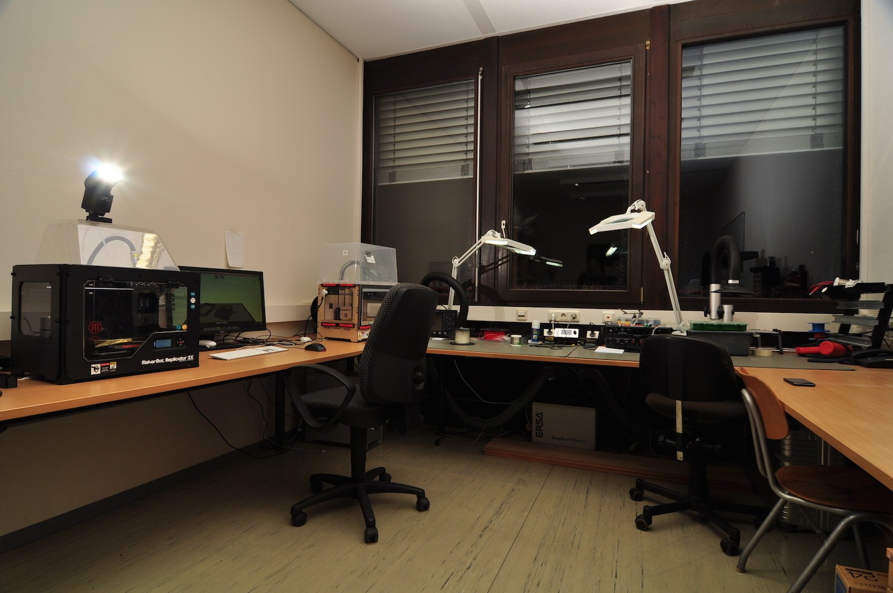

Die Bestrebungen, ein Fab Lab an der Uni Siegen anzusiedeln, sind nicht ganz neu. In kleinerem Maßstab wurden ähnliche Aktivitäten bereits an der Fakultät III durchgeführt: 

Das dortige HCI-Lab stellt(e) ebenfalls in gewissem Rahmen Infrastruktur (z.B. 3d-Drucker) bereit. Auch wenn im HCI-Lab prinzipiell ebenfalls recht offen gearbeitet wird, so gibt es hier keine Open Lab Days, die Ausstattung ist nicht umfangreich, die Fläche sehr klein und außerdem wird der Raum oft für Lehrstuhl-Aktivitäten benötigt und kann dann natürlich nicht von jedem genutzt werden. Wir erwähnen das HCI-Lab hier jedoch ausdrücklich, da durch seinen Betrieb schon einiges an Kompetenzen, gerade in Bereichen wie 3d-Druck oder auch Arduino geschaffen wurde. Das Fab Lab Siegen und das HCI-Lab werden daher eng kollaborieren (z.B. für Lehrveranstaltungen und Workshops) und teilweise evtl. auch Hardware und Ausstattung konsolidieren.