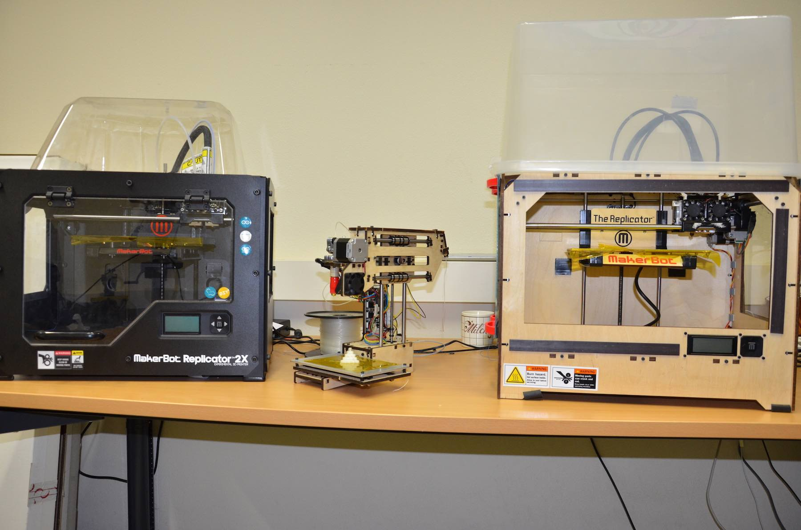
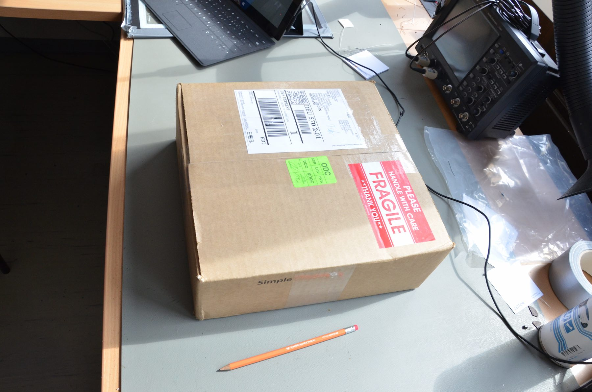
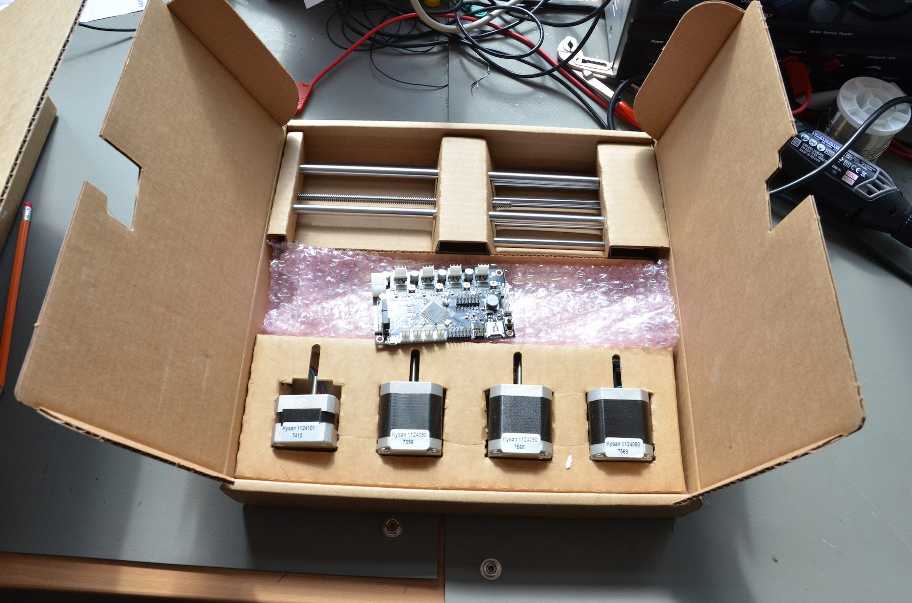
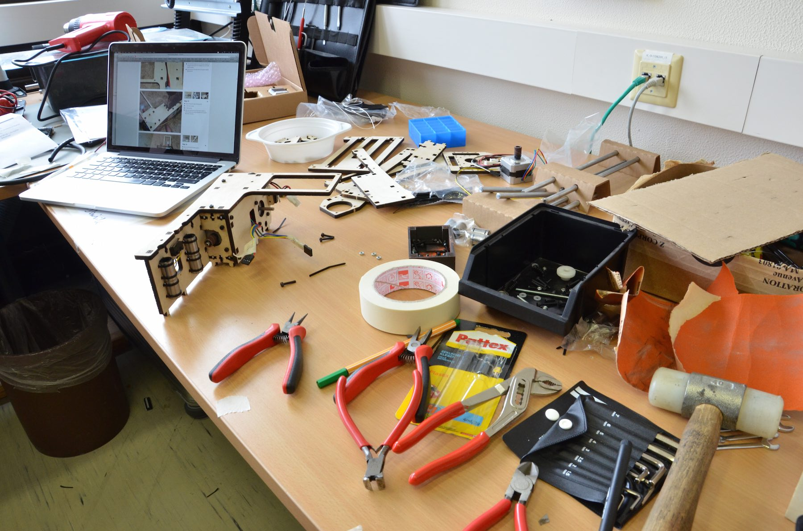
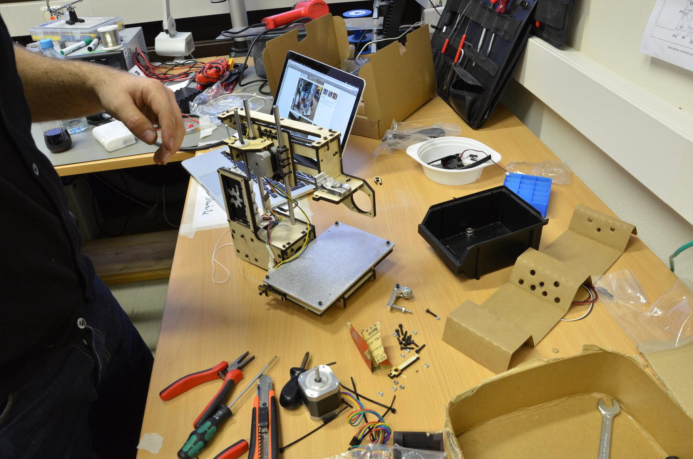
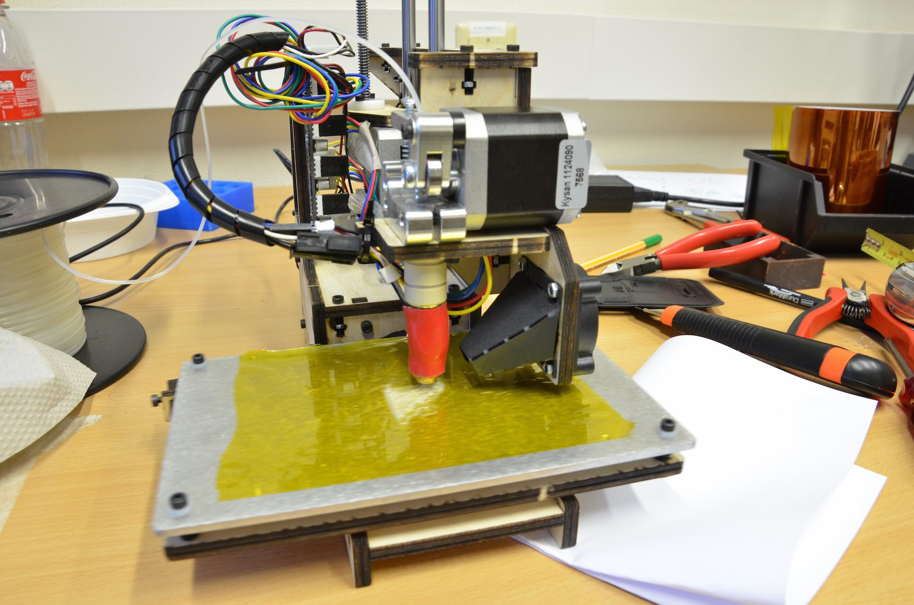
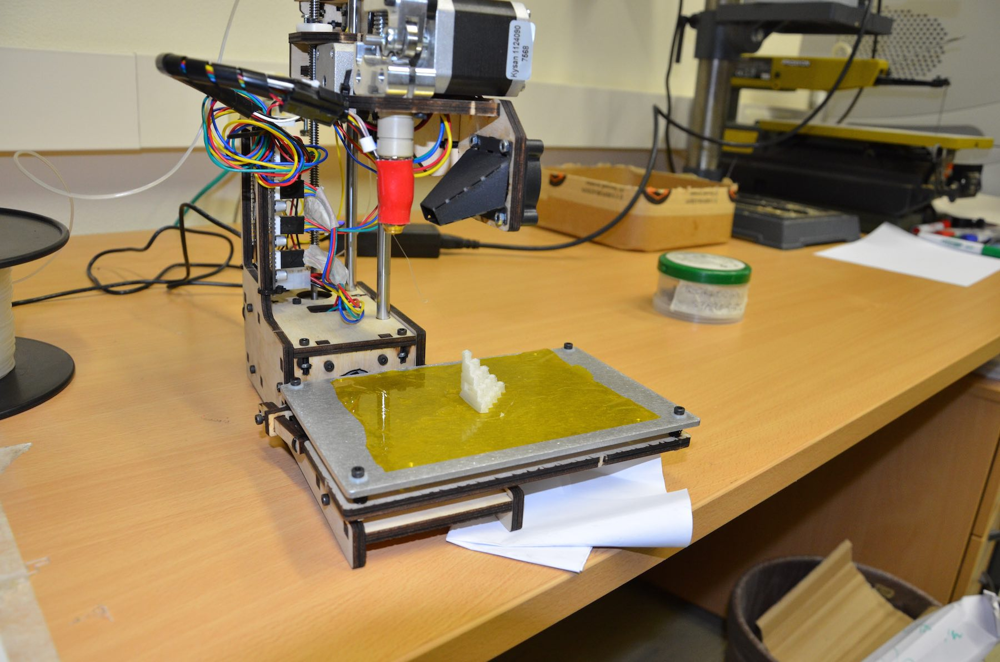

Der kleine aber feine Printrbot 3D-Drucker aus dem [Simple Maker’s Kit](http://printrbot.com/product-category/3d-printers/simple-makers-kit/), den wir für unsere [Maker-Reise nach Palästina](http://hci-siegen.de/hci-studierende-forschen-in-palastina/) gekauft haben, ist endlich zusammengebaut und einsatzbereit. Der Zusammenbau war tatsächlich relativ einfach und hat nicht mehr als einen Arbeitstag an Zeit verschlungen. Ein erster Druck hat gezeigt, dass zwar noch etwas an der Kalibrierung gefeilt werden muss, aber insgesamt alles einwandfrei funktioniert. Nächste Woche wird er endlich seiner Bestimmung zugeführt und inspiriert die Kinder im [Come_In-Computerclub](http://comeinatpalestine.wineme.fb5.uni-siegen.de/) im Flüchtlingslager Jalazone in Ramallah, hoffentlich zu vielen kreativen Maker-Projekten.

Angehängt seht ihr noch ein paar Fotos vom Zusammenbau und dem ersten Druck.

