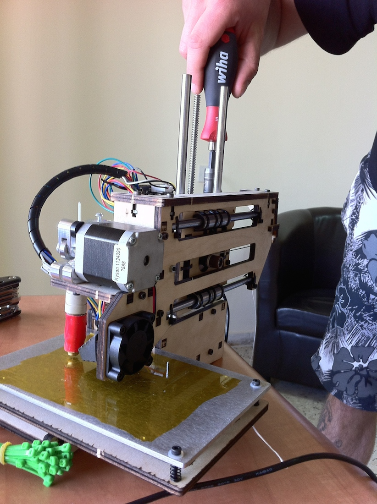

<iframe width="560" height="315" src="https://www.youtube.com/embed/lkPAVHzcZiM" frameborder="0" allowfullscreen></iframe>

Nachdem wir unseren kleinen Freund – namentlich Printrbot Simple - für den Flug nach Tel Aviv und die anschließende Fahrt nach Palästina ein wenig zerlegen mussten, haben wir ihn nun wieder zusammengesetzt. Wer sich selbst einen Überblick über den ganzen Zusammenbau des 3d-Druckers machen möchte, findet hier unsere Fotostory und hier die ausführliche Anleitung von Printrbot selbst.

Für uns war noch zu tun:

- Eine Hand voll neuer Kabelbinder anbringen um die Druck-Plattform an den Führungsstangen zu fixieren
- Die Antriebs-Schnüre fixieren und auf Spannung bringen (diese Schnüre bewegen die Plattform)
- Die Druck-Plattform mit dem neuen Blue Tape von YouIn3d bekleben, was dafür sorgt, dass das PLA (zum Druck verwendetes Plastik) gut an der Plattform haften bleibt
- End-Anschläge kalibrieren, was insbesondere auf der z-Achse (nach oben / unten) ein wenig fummlig ist, da hier erst die Druckplattform mit vier Schrauben nivelliert werden muss und anschließend per z-End-Anschlag das Hot-End (der Druckkopf) in eine Ausgangsposition gebracht werden muss, in der ein Blatt Papier noch gerade so eben zwischen Hot End und Druckplattform passt. Gerade beim Nivellieren und Kalibrieren war unser Wiha-Werkzeug sehr nützlich.

Nachdem wir all das erledigt hatten, musste noch die Software – wir verwenden [Repetier Host](http://www.repetier.com/) – auf die Spezifikationen des Printrbot Simple eingestellt werden (Anleitung [hier](http://printrbot.com/wp-content/uploads/2013/07/Getting-Started-Guide-Simple.pdf)). Anschließend ging’s dann ans Drucken, wofür wir uns einen Calibration Cube von Thingiverse heruntergeladen haben. Beim ersten Druckversuch musste der z-Endstop noch ein wenig nachjustiert werden, danach ging es zu unserer Begeisterung aber absolut flüssig weiter – der Printrbot druckte wie eine Eins und der Calibration Cube wurde hervorragend, insbesondere für einen ersten Druck. Gleich im Anschluss haben wir noch testweise eine Pfeife gedruckt, denn Kinder auf der ganzen Welt machen schließlich gerne Lärm – auch das hat ausgezeichnet funktioniert!

Weiter geht’s diesen Sonntag – dann werden wir den Drucker erstmalig den Volunteers im al-Am’ari Camp vorstellen und erklären und anschließend anfangen, mit den Kindern und dem Drucker zu arbeiten. Stay tuned!