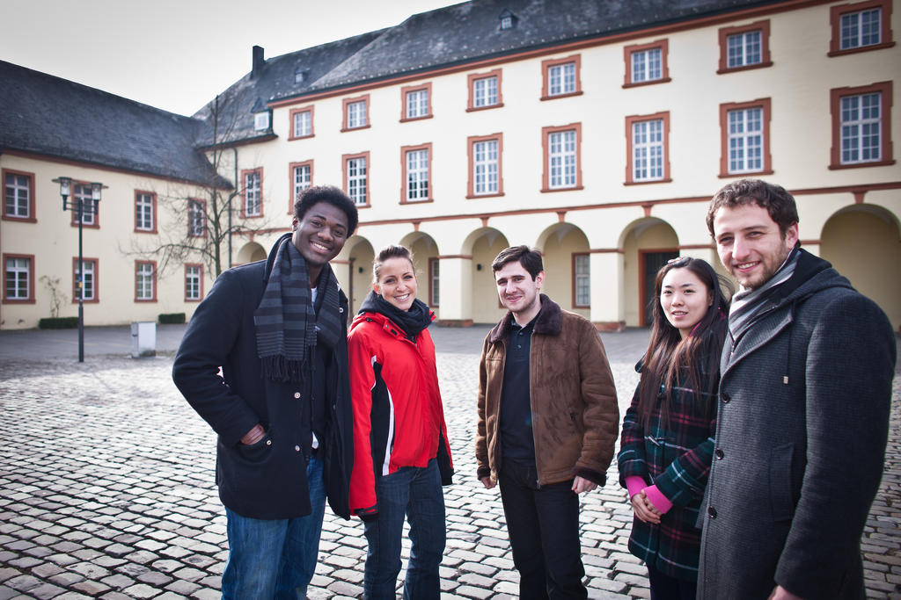

Mit dem Umzug der Fakultät III ins Untere Schloss und das ehemalige Krankenhaus ist die Uni Siegen nun erstmals richtig in Siegen angekommen (“gelandet”, sozusagen, ein Thema, das übrigens auch in einem [Kunstprojekt](http://die-landung.wineme.fb5.uni-siegen.de/) aufgegriffen wird). Das Fab Lab Siegen wird sich bemühen, hier auch als Verbindungsmöglichkeit zwischen Stadt, Region und Uni zu wirken. Ein paar Ideen hierzu, die angedacht sind:

- [Repair Café](http://de.wikipedia.org/wiki/Repair_Caf%C3%A9) – Aktionen
- Leerstehende Geschäfte in der Siegener Oberstadt mit (temporärem) Leben füllen und z.B. mit Kunst, aber auch mit Produkten aus dem Fab Lab Showroom-artig füllen. Diese Produkte können dann von Kunden gekauft und direkt im Fab Lab (bei Interesse sogar unter Teilnahme der Kunden) gefertigt werden.
- Kooperationen mit Schulen und anderen Bildungseinrichtungen für Kurse und Workshops im Fab Lab.
- Kurse (Feilen, Sägen,…) im Fab Lab, z.B. von Ausbildungs-Meistern aus der Region geben lassen, die im Austausch dafür auch einmal Lasercutter u.Ä. benutzen können. So wird Wissen erhalten und neues geschaffen und die Uni mehr geöffnet.

*Featurebild: Studierende am Unteren Schloss (Foto: Pressestelle Uni Siegen)*