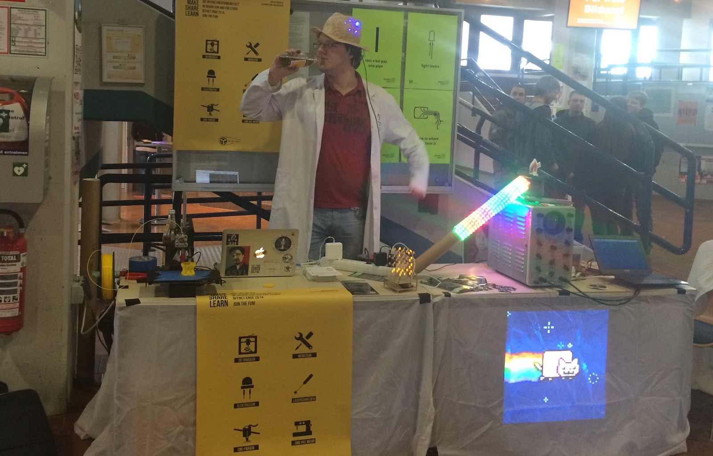

Im Moment hat das Fab Lab Siegen noch nicht geöffnet, deshalb gibt es noch keine regelmäßigen Öffnungszeiten oder Ähnliches. Das heißt aber nicht, dass nichts zu tun ist - von der Planung und dem Einkauf von Maschinen und Material über die Akquise von Sponsoren bis hin zum Brainstorming für erste Workshops und Repair Cafés gibt's immer allerhand zu tun. Wer interesse hat: Kontaktiert uns hier, über [Facebook](https://www.facebook.com/fablabsiegen) oder via [Twitter](https://twitter.com/fablabsiegen/)!

### In Zukunft
Hier als grober Eindruck, was euch in Zukunft im Fab Lab Siegen erwartet:

- Regelmäßige offene Tage / Abende, in denen jede/r (nicht nur Studierende!) im Lab basteln, Prototypen für ein Projekt oder gar ein Startup bauen, oder einfach nur brainstormen und einen Kaffee trinken kann.
- Lehrveranstaltungen - wir konzipieren z.B. an einer Vorlesung, die in die Möglichkeiten eines Fab Labs einführt. Fakultätsübergreifend und interdisziplinär!
- Kollaborationen, z.B. mit Schulen oder anderen Bildungseinrichtungen.
- Vorträge, Events und Workshops, z.B. zu Gelegenheiten wie dem [Arduino Day](https://day.arduino.cc). 