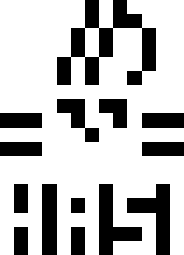

Es ist immer wieder beeindruckend, wieviele spannende, selbst-organisierte und offene Aktivitäten in einer recht kleinen Stadt wie Siegen bereits geschehen. Eine solche Unternehmung ist der [Hackspace Siegen e.V.](https://hasi.it) (HaSi). 

Ein Hackspace und ein Fab Lab sind sich konzeptionell recht ähnlich – beide sind offene, kreative Umgebungen, in denen Projekte verwirklicht werden können, Vorträge und Workshops gehalten werden und ganz viele andere spannende Dinge geschehen. Grundsätzlich kann man allerdings sagen, dass ein Hackspace eher Software-nah ist, während man sich in einem Fab Lab eher auf Produktion und Hardware mit Maschinen und Werkzeugen konzentriert. Aus diesem Grunde ergänzen sich beide Konzepte hervorragend und Fab Lab und HaSi werden in regem Austausch arbeiten, sich gegenseitig für Projekte unterstützen und die unterschiedlichen Kompetenzen gut nutzen!