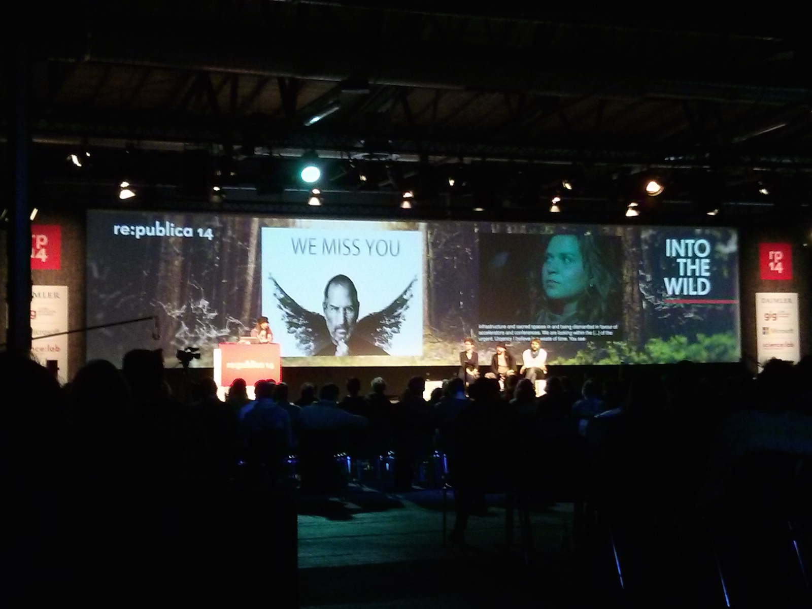
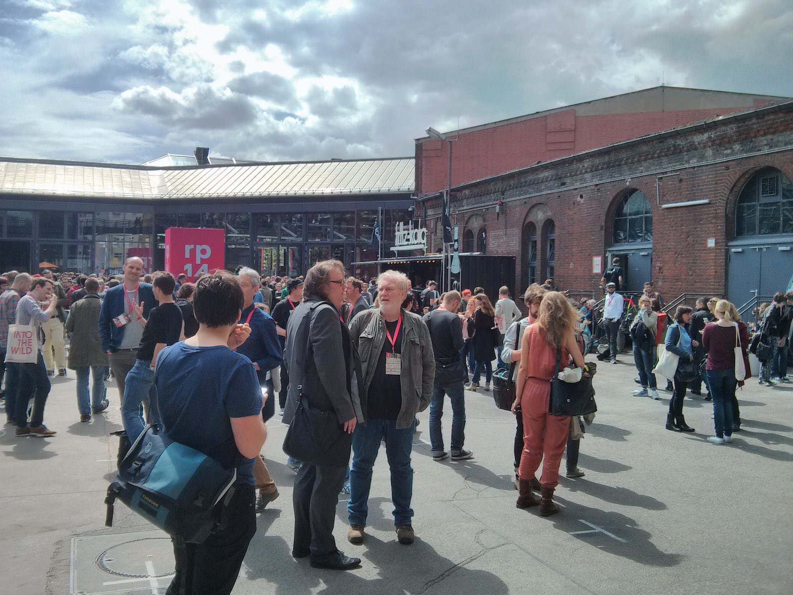
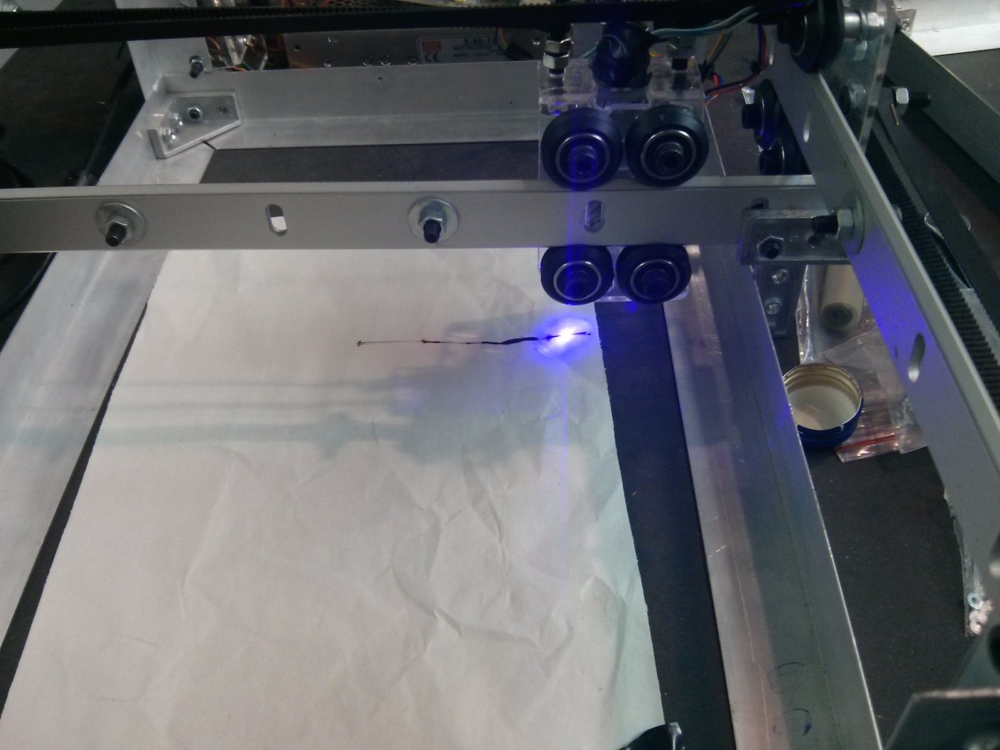
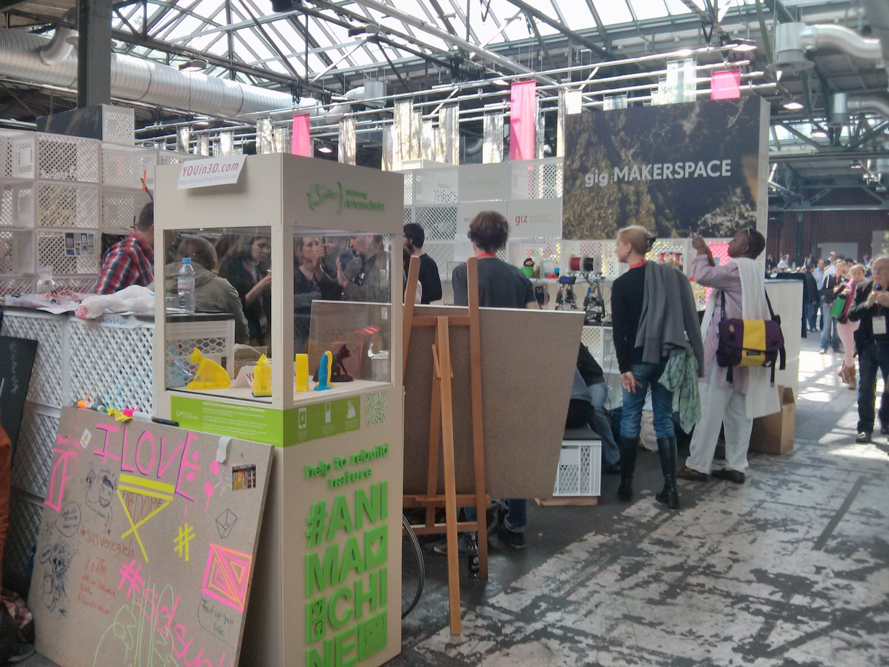

Wir lassen es uns natürlich nicht entgehen, auf der [re:publica](https://re-publica.de), der größten deutschen Konferenz / Happening / Party / Ding zum Thema Web, Technik  und mittlerweile auch zunehmend Making vor Ort zu sein. Wir selbst sind (noch) nicht mit eigenen Beiträgen am Start, sondern möchten in diesem Jahr erst einmal mit anderen Makern aus verschiedenen Kulturkreisen sowie Entrepreneurs, Investoren und den Tausend anderen Menschen, die so an Fab Labs beteiligt sind, in Kontakt treten. 

Ein paar der Dinge, über die wir uns in Gesprächen und auf Workshops Gedanken gemacht haben:
- Erfahrungswerte (Zeitbedarf, Maschinen-Erfahrungen, etc.)
Sammeln von Impulsen und Erfahrungen hinsichtlich Geschäfts- und Finanzierungsmodellen für Fab Labs
- Welche Ideen und Erfahrungen für nachhaltige Industrie-Kooperation, die aber nicht das Grassroots-Selbstverständnis der Maker-Bewegung negativ beeinflusst, gibt es?
- Wie gestalten sich Maker-Kulturen und -Interventionen in anderen Kulturkreisen (auf der re:publica ist weltweites Publikum unterwegs)
Wie sind Maker in gesellschaftliche Umbruch-Prozesse in anderen Kulturen eingebunden?

Es ergaben sich verdammt viele interessante Gespräche und Gelegenheiten - unten ist z.B. ein DIY-Lasercutter namens Risha zu sehen, der uns in seinen Bann gezogen hat - daraus wird sicher mehr werden! :) 

