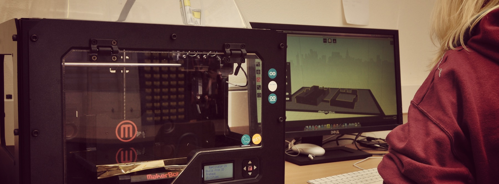

[*Fab Lab*](http://de.wikipedia.org/wiki/FabLab) steht für *Fabrication Laboratory*. Solche Labs sind offene Werkstätten, die viel - aber nicht ausschließlich - auf High-Tech-Geräte setzen und in denen man fast alle Projekte planen und als Prototypen oder Kleinst-Serien vor allem auch produzieren kann. Das reicht inhaltlich von der künstlerischen Skulptur bis hin zum Microcontroller-gesteuerten Home-Automation-System – der Fantasie sind keine Grenzen gesetzt.

Zur Verfügung stehen Maschinen, die sich z.B. aus 3d-Druckern, CNC-Fräsen, Nähmaschinen, Kunstzubehör und vielen anderen spannenden Dingen zusammensetzen. Es wird immer darauf geachtet, dass die Geräte für jeden einigermaßen bedienbar sind - anders als z.B. klassische Lehrwerkstätten sind Fab Labs nämlich wirklich für jeden gedacht, unabhängig von Expertise, Fachrichtung oder Beruf!

Fab Labs sind ein [weltweiter Trend](http://fablabs.io) und zusammen mit ähnlichen Bewegungen (Hackspaces, Makerspaces,...) werden sie zunehmend wichtiger als Innovations-Quelle - sei es nun für echte Grassroots-Projekte oder auch als Startup-Inkubatoren. Mehr über die deutschen Fab Labs könnt ihr auf [fabrikationslabor.de](http://fabrikationslabor.de) erfahren (Seite ist derzeit im Aufbau).