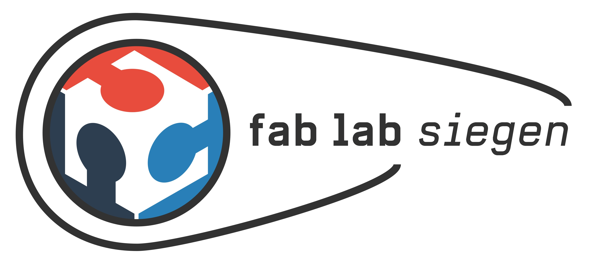

Wir hatten es bereits verschiedentlich erwähnt: Das Fab Lab hofft auf die alten Küchenräume des ehemaligen Krankenhauses, das Teil des neuen Campus Siegen Altstadt ist.

Diese Räume wären perfekt für das Lab geeignet, da der Boden natürlich extrem robust und abwaschbar ist, Strom und Wasser reichlich vorhanden sind und vor allem Zu- und Abluftöffnungen schon vorhanden sind – in anderen Räumlichkeiten wie z.B. Seminarräumen müsste dies erst kostenintensiv nachgerüstet werden. Auch eine Abgrenzung was Lärm angeht ist zum Rest der Büroräume und Co. vorhanden, so dass auch mal am Tag gehämmert werden könnte und weiterhin gibt’s eine eigene Außentür zu diesen Räumen. Leider ist die Anmietung / Verwendung dieser Räumlichkeiten noch unklar, sie sind derzeit nach unserem Wissensstand noch kein Bestandteil des Mietvertrages der Uni, andere Verwendungen gibt es aber auch noch nicht. Der wichtigste Punkt, der uns auch zum Kern dieses Beitrages bringt, ist jedoch der folgender:

## Mehrere Interessenten
Wie wir vor wenigen Tagen erfahren haben, interessiert sich auch das [Campusradio](http://www.radius921.de/) für diese Räumlichkeiten und legt hier ein Nutzungskonzept beim Kanzler der Uni vor. Ganz wichtig an dieser Stelle ist: Wir, das Fab Lab Team sehen das nicht als Konkurrenz und dieser Post ist keinesfalls als “aber wir wollen die Räume unbedingt” zu verstehen – ganz im Gegenteil, aus unserer Sicht birgt die Situation große Chancen: Wenn wir es gemeinsam schaffen, aus den alten Küchenräumen eine Art “Stockwerk für studentische Initiativen” zu machen, wäre das eine tolle Sache für die Uni, die Initiativen und für alle Studierenden! Wir gehen davon aus, dass das Campusradio bisher noch nichts über unser Interesse an den Räumen wusste – genau wie wir andersherum auch nichts wussten – wir sollten uns daher unbedingt vernetzen, weshalb wir uns natürlich sofort sowohl an die Redaktion des Radios als auch an die Firma Quast (das ist der Bauträger im Krankenhaus) gewendet und über die Fab Lab Initiative und die mögliche gemeinsame Nutzung informiert haben. Auch den Kanzler informieren wir heute noch, so dass hoffentlich allen relevanten Parteien die wichtigen Informationen zur Verfügung stehen.

[Hier](images/nk-kkh.pdf) findet ihr das Nutzungskonzept, das wir verfasst haben und das auch bereits eine Nutzung mit anderen studentischen Initiativen gemeinsam vorsieht.

Dieser Blog-Post soll nun alle Interessierten Parteien über diese neuen Entwicklungen informieren und wir hoffen, dass hoffentlich möglichst bald eine Diskussion über die Anmietung und die Nutzungsmöglichkeiten dieser spannenden Räumlichkeiten stattfindet. Uns liegt es sehr am Herzen, dass diese Diskussion möglichst offen geführt wird um zu vermeiden, dass es noch einmal zu Situationen kommt, in der eine Partei nichts vom Interesse einer anderen weiß. An dieser Stelle daher der Aufruf an jede/n Interessierten, an der Diskussion teilzunehmen und sich einzubringen.

Wir werden informieren, sobald wir mehr wissen! Stay tuned! :)