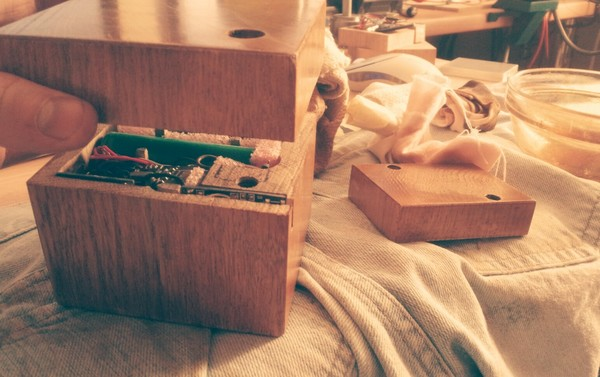
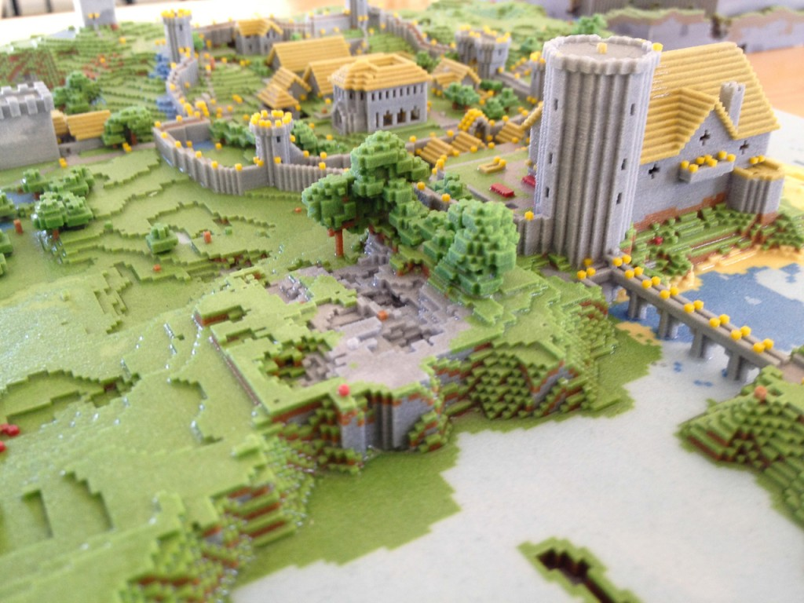
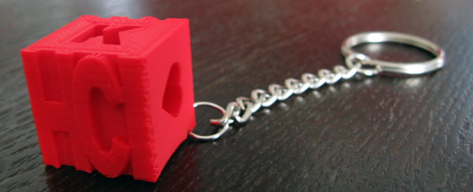
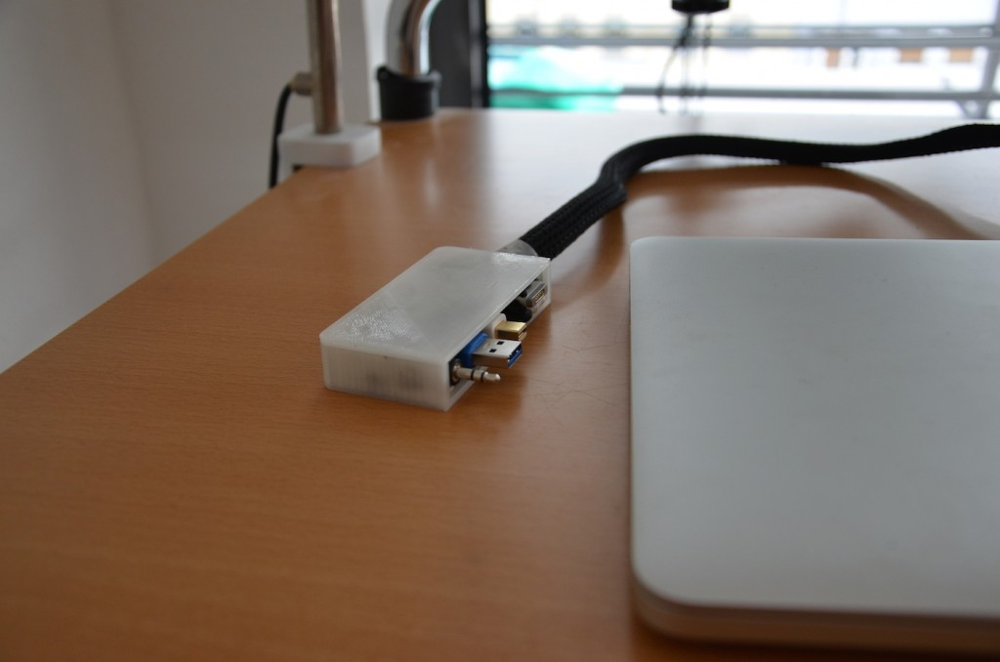

Um einmal zu zeigen, dass in Siegen und dem Umfeld bereits spannende Fab Lab- und Maker-nahe Projekte entwickelt wurden, die im Fab Lab Siegen größer, besser, schneller untergebracht wären und dort noch ausgeweitet werden können, möchten wir hier als kleinen Vorgeschmack einige solcher Projekte vorstellen:

#C3POW / Avoccado

Auf dem Feature-Bild (Foto: Alex Shure) zu sehen: Ein drahtloses, haptisches Eingabegerät, mit dem z.B. Hausautomation, Musikanlagen, etc. über Gesten, Bewegen des Gerätes und andere Interaktionen gesteuert werden. Mehr Informationen [hier](https://avoccado.cc).

#Printing Minecraft

3d-Modelle zu erstellen, die man drucken oder fräsen kann, ist nicht ganz einfach, wird aber als Fähigkeit immer wichtiger. Eine kreative Lösung, um Kindern spielerisch frühzeitig entsprechende Fähigkeiten beizubringen: Man nehme das beliebte Spiel Minecraft, lasse Kinder damit spielen, exportiere die Strukturen, die die Kinder darin bauen und überführe sie per 3d-Drucker in die physikalische Welt. Die Kinder haben viel Spaß und lernen selbständig und innovativ.

#Erinnerungswürfel

Zum Abschluss des Studiums produzierte sich Laura Festel ihren ganz eigenen Erinnerungs-Schlüsselanhänger. Bemerkenswert ist, dass sie vorher noch nie mit 3d-Modellen, CAD oder 3d-Druck gearbeitet hat. Hier sieht man, wie einfach und schnell mit digitaler Fertigungstechnologie eigene Projekte realisiert werden können!

# Hackdock

Eine selbst entwickelte, günstige, 3d-gedruckte Docking-Lösung für Notebooks, die das Kabel-Chaos auf dem Schreibtisch verschwinden lässt.

