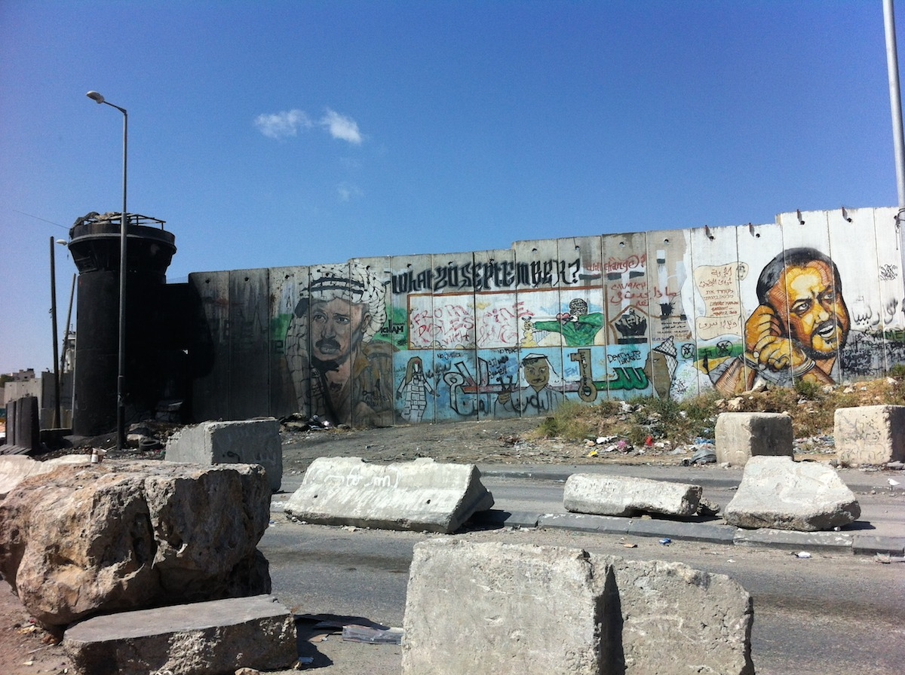

Zwei der Mitglieder des Fab Lab Siegen sind derzeit in Palästina mit unserem kleinen Printrbot 3d-Drucker unterwegs. Über ihre ersten allgemeinen Erfahrungen im Nahen Osten berichten sie auf der Website ihres Master-Studienganges "Human Computer Interaction Siegen" in drei ausführlichen Blog-Posts:

**[First Impressions](http://hci-siegen.de/hcipalestine-first-impressions/)**

**[3D Printing, Religion, Refugee Camps](http://hci-siegen.de/hcipalestine-3d-printing-religion-and-refugee-camps/)**

**[More 3D printing and traveling the West Bank](http://hci-siegen.de/hcipalestine-more-3d-printing-and-traveling-the-west-bank/)**

**[Zeitungsbericht](/content/images/2015/02/palaestina-zeitung.jpg)**