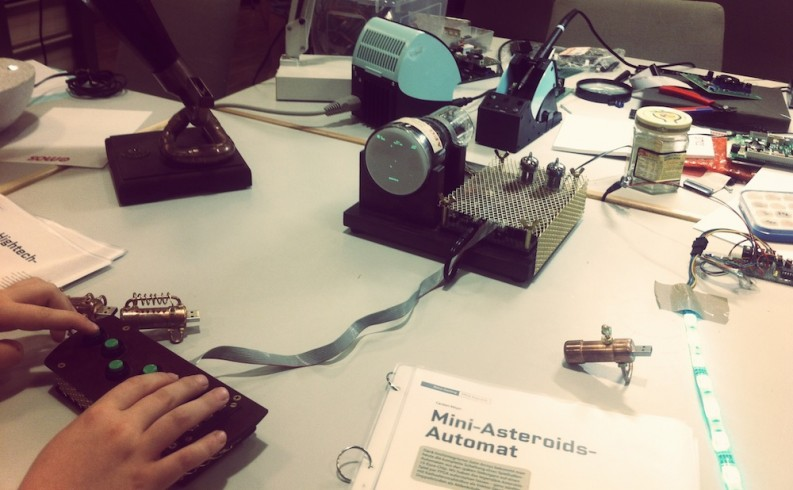

[Maker Faires](http://en.wikipedia.org/wiki/Maker_Faire) sind in den letzten Jahren immer populärer gewordene Veranstaltungen der Maker / Fab Lab / Do-It-Yourself-Szene. Auf den meist ein- bis zweitätigen, bunten Events finden sich Maker aus der ganzen Welt zusammen, zeigen ihre Projekte, halten Vorträge, verkaufen vom Microcontroller bis hin zur Elektronenröhre alle möglichen und unmöglichen Dinge und tauschen sich aus.

Wie auch im letzen Jahr hat die [c’t Hacks](http://www.heise.de/make/) die größte Maker Faire in Deutschland organisiert, die vom 05.-06.07. in Hannover stattgefunden hat. Die gebotene Bandbreite war – ganz wie es sich für ein Event von und für Kreative gehört – riesig: Vom hydraulischen (und feuerspeienden!) Metall-Drachen über Quadrocopter, Arduino-Projekte bis hin zu Fab-Lab-Vorstellungen, Vorträgen und Steampunk war alles vertreten. Auch das Fab Lab Siegen war vor Ort und Dominik und Oliver haben einen Vortrag über ihren Maker-Trip nach Palästina gehalten. Schön war’s und für alle, die nicht nach Hannover kommen konnten, wird der Vortrag kommenden Donnerstag den 17.07. um 20:30 im [Hackspace Siegen](http://hasi.it/) noch einmal [gehalten werden](http://hasi.it/talk/2014/07/17/palaestina.html).

Vielen Dank an die Redaktion von c’t Hacks für die tolle Organisation der Maker Faire und die Gelegenheit, unsere Arbeit vorzustellen! Wer mehr über die Maker Faire lesen und sehen möchte, der findet [hier](http://makerfairehannover.com/) viele Fotos, Videos und Interviews!