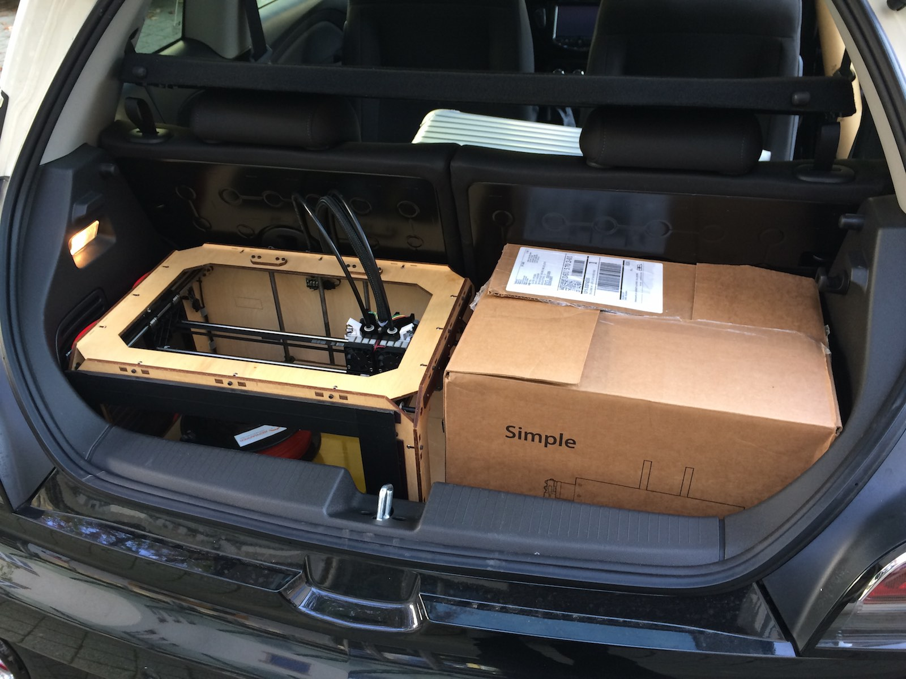
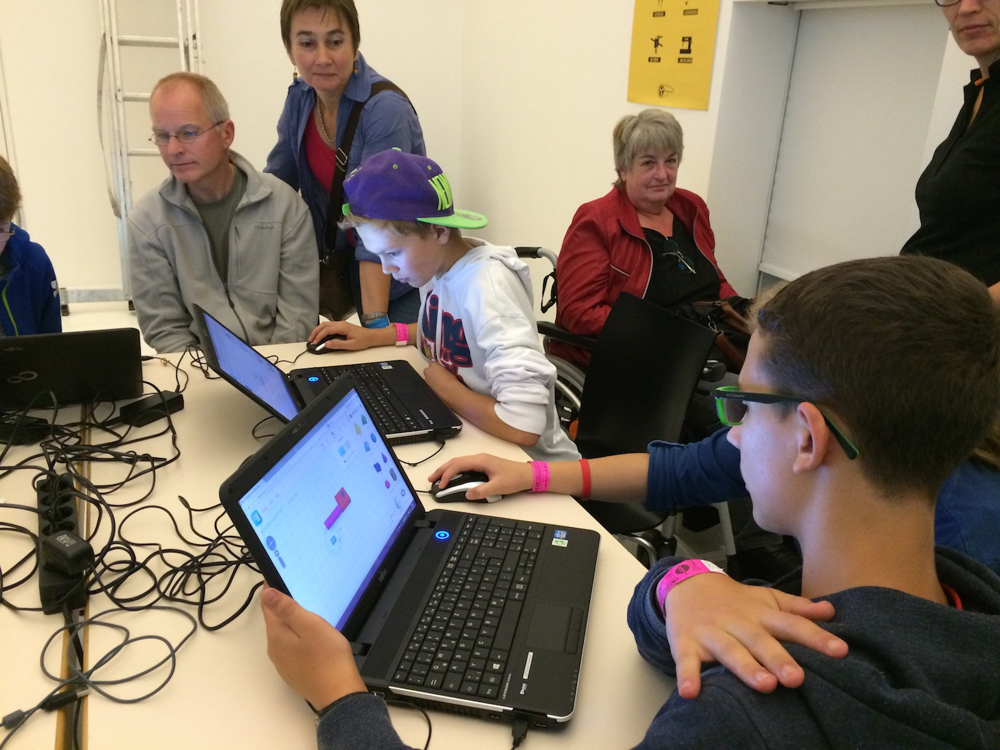
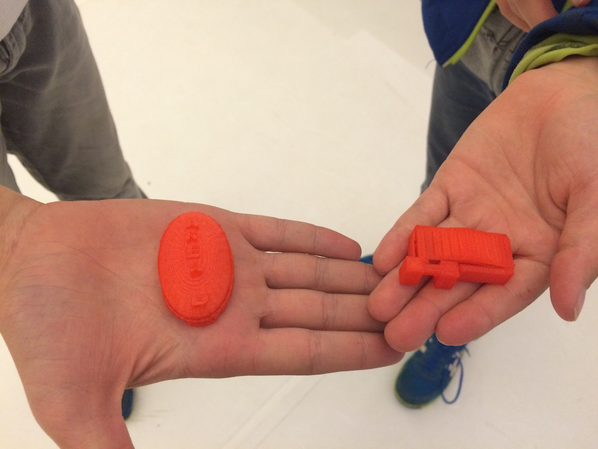
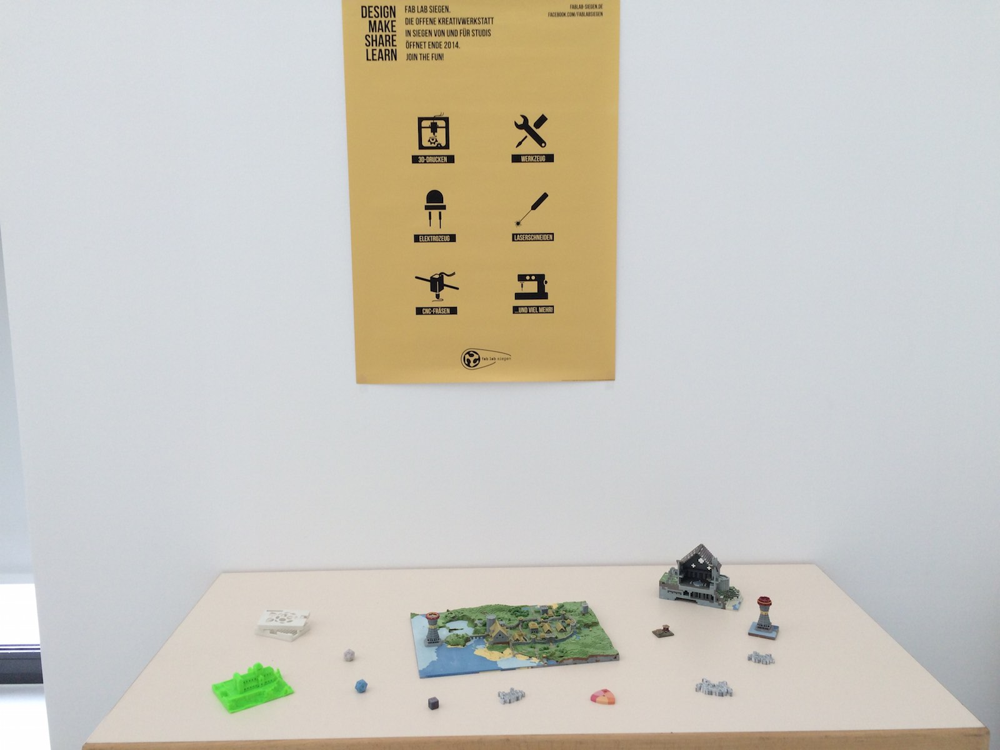
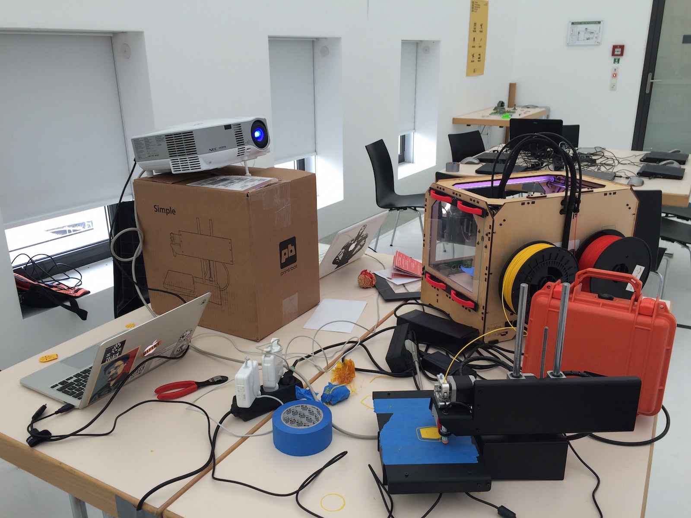

Die [Mini Maker Faire Dortmund](http://makerfairedortmund.abcde.biz) war – wie alle Maker Faires – eine tolle Veranstaltung. Es gab von Steampunk-Equipment bis zu DIY-Aquaponik wieder viel zu bestaunen und auszuprobieren. Besonders schön war, dass diese Mini Maker Faire in die [Wissensnacht Ruhr](http://www.wissensnacht.ruhr/home/), eine das ganze Ruhrgebiet umspannende Veranstaltung, eingebunden war und damit werbe-technisch auch viele Leute erreicht hat, die sonst vielleicht nichts von der Maker Faire gehört hätten.

Wir haben es uns natürlich nicht nehmen lassen, auch dabei zu sein! Dominik hat einen Vortrag über ein Forschungsprojekt gehalten und Oli einen über Fab Labs und digitale Fabrikation. 

Viel wichtiger noch: Diesmal hatten wir einen Stand, auf dem wir 3D-Druck Workshops für Einsteiger angeboten haben. Hierfür hatten wir zwei 3D-Drucker, eine ganze Menge Notebooks sowie ein paar Demo-Objekte im Gepäck. Unseren Teilnehmern haben wir auf den Workshops dann zum Einstieg ein paar Basics des 3D-Drucks erklärt und Fragen beantwortet, sowie natürlich einen Druck vorgeführt. Anschließend ging’s ans Eingemachte und sie durften per [TinkerCAD](https://www.tinkercad.com) ganz eigene 3D-Modelle erstellen, die wir dann direkt vor Ort gedruckt haben. Wie immer bei solchen Aktionen haben die Teilnehmer schnell bemerkt, dass das alles gar nicht so kompliziert und abschrecken ist, wie es vielleicht im ersten Moment klingt und es sind einige tolle und ganz individuelle Modelle dabei herausgekommen (einige davon seht ihr in den Fotos).

Uns und den Teilnehmern hat es großen Spaß gemacht. Trotz diverser technischer Probleme, insbesondere mit dem WLAN, haben wir alles gut über die Bühne gebracht und – so hoffen wir – einige Leute für Fab Labs, 3D-Druck und digitale Fabrikation im Allgemeinen begeistert.

