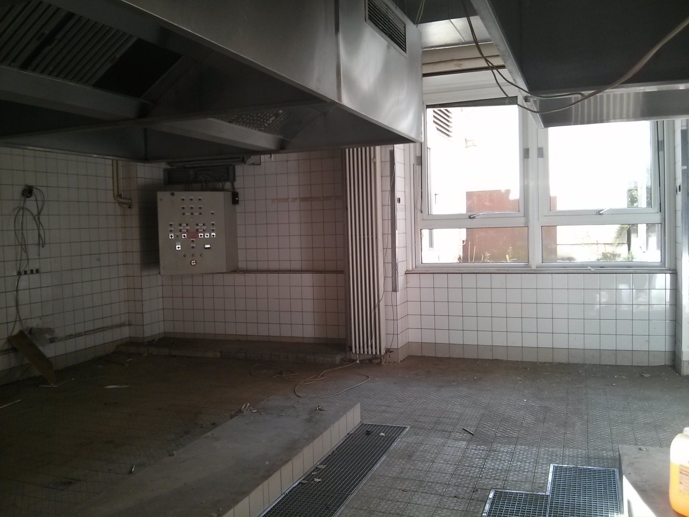
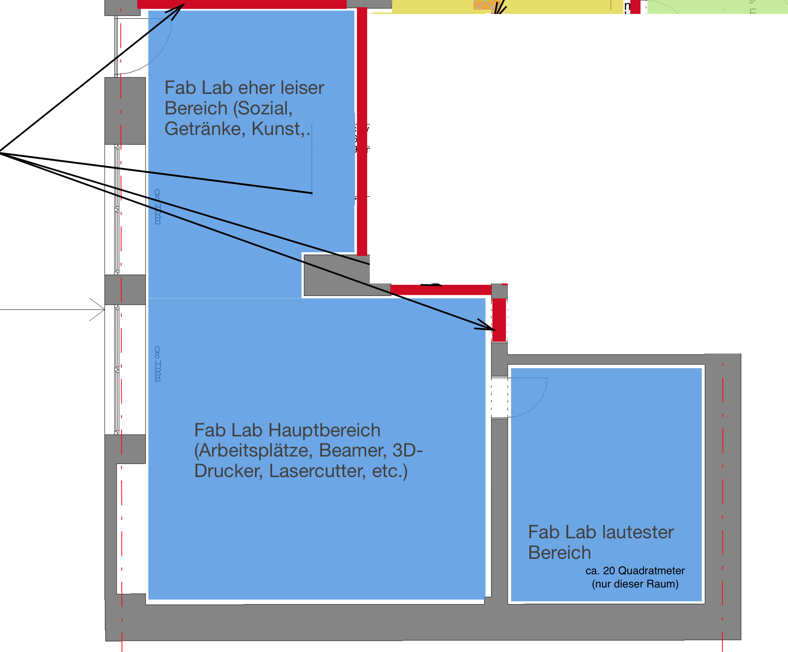

Der Grund, warum es in den letzten Monaten so still um das Fab Lab war, ist einfach: Die Akquise eines Raumes hat sich immens verzögert. Jetzt können wir jedoch endlich und mit großer Freude verkünden:

**Wir bekommen Räume!**

Die Siegener Gesellschaft zur Förderung der Altstadt, der das neue Uni-Gebäude (altes Kreiskrankenhaus) gehört, hat sich freundlicherweise bereiterklärt, uns bzgl. der Räume auszuhelfen. Wir bekommen nun in der Tat einen Teil der ehemaligen Küchenräume, die für unsere Zwecke schlichtweg perfekt geeignet sind (zentral, eigener Eingang, mehr als robust,...)!

Wir würden unglaublich gerne sofort in die Räume ziehen und endlich unsere Großgeräte bestellen - aber etwas Geduld brauchen wir leider noch, denn die vertraglichen Rahmenbedingungen müssen erst noch durch die Uni-Verwaltung. Wir hoffen jedoch, dass das schnell erledigt ist.

Hier einmal ein Vorgeschmack. Die Baupläne dürfen wir nicht vollständig veröffentlichen, daher nur ein retuschierter Screenshot, der aber hoffentlich für einen ersten Eindruck ausreicht. Eingang ist oben links, der separate Raum unten rechts hat ca. 20 Quadratmeter - damit bekommt man dann auch eine Einschätzung der Gesamt-Größe, die uns zur Verfügung stehen wird!

