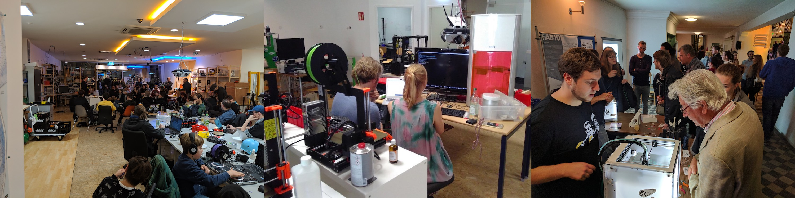
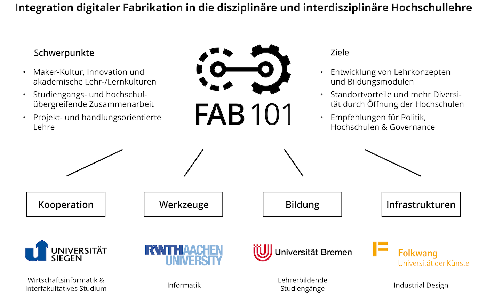
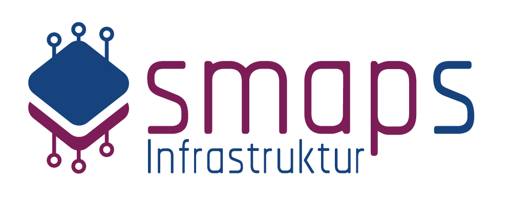
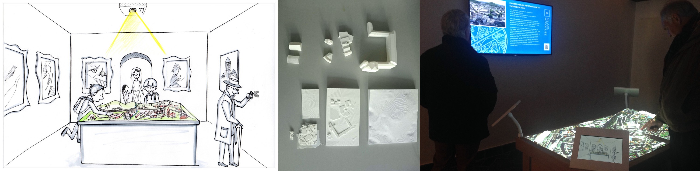
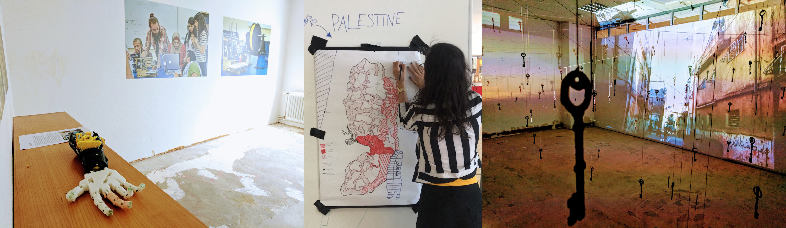

Das Fab Lab Siegen ist eine offene Forschungs- und Lehrinfrastruktur, die interdisziplinär und interfakultativ mitgenutzt, mitgetragen und mitgestaltet werden kann und soll.

Die Nutzung des Fab Labs durch Forschungsprojekte und die forschungsunterstützenden Arbeiten durch das Labor sind vielfältig gewachsen. Sie reichen von der Beforschung des Fab Labs als Organisation und \(Kreativ-\)Community über Beratungen, Workshops, Führungen, Demos, F&E und andere Services für die Forschung bis zur Nutzung des Labs für Events. Auch für partizipative, community-orientierte Forschung , Citizen Science, Transfer und Wissenschaftskommunikation eignet sich das Labor gut. 

## Reallabor Fab Lab Siegen

Das Fab Lab Siegen selbst hat angewandte Forschungsaufgaben zur Rolle und Organisation von Fab Labs und ähnlichen, neuen und offenen Strukturen ausgehend von der öffentlichen Hand. Der Aufbau erfolgt daher als “Reallabor eines Labors”, d.h. das Labor wird als möglichst flexible, agile, experimentelle Struktur _bottom up_ aufgebaut. Es folgt in seiner Entwicklung sowohl Hochschul-, Forschungs- und Lehr-Interessen aus möglichst vielen Fachbereichen sowie der Nachfrage, die sich aus der Community und der Region in der Praxis ergeben.  

## FAB101

Das seit 2017 laufende, vom BMBF geförderte Projekt [FAB101](https://fab101.de) beforscht die Potenziale digitaler Fabrikation für die Hochschullehre der Zukunft. Gemeinsam untersuchen die Uni Siegen, die RWTH Aachen, die Uni Bremen und die Folkwang UdK werden Bildungskonzepte, Infrastruktur-Aspekte sowie Fragen der Hochschulgovernande im Zusammenhang mit Fab Labs untersucht. 

## Zentrum für Smart Production Siegen

Im Forschungs-Infrastrukturprojekt [Zentrum für Smart Production Siegen ](https://www.uni-siegen.de/start/news/forschungsnews/867763.html)sollen intelligente Werkzeuge entwickelt und erforscht werden, um den Wandel zur Industrie 4.0 aktiv mitzugestalten. Wir werden insbesondere zu 3D-Druck im Kontext Mittelstand und zur Aus-/Weiterbildung im Zusammenhang mit Fab Labs unterstützen. 

## ZEIT.RAUM Siegen

Im Regionalprojekt [ZEIT.RAUM Siegen](https://zeitraum-siegen.de) stehen regionale Kulturarbeit und neue Vermittlungsformen im Museum im Vordergrund. Im Fab Lab Siegen entstand für das Projekt ein interaktives Stadtmodell in Tischgröße, das mit 3D-Druck, Einplatinencomputern, Sensorik und anderen „Maker-Technologien“ entwickelt wurde. Es ist im Siegerlandmuseum ausgestellt.

## YALLAH

Das Projekt [You All Are Hackers](https://yallah.exchange) ist ein vom DAAD geförderter Studierendenaustausch zwischen Palästina und Deutschland. Die teilnehmenden Studierenden arbeiten in beiden Ländern an der Lösung sozio-technischer Probleme unter Verwendung moderner Methoden wie z.B. Design Thinking oder Rapid Prototyping unter Verwendung der digitalen Fabrikationsinfrastrukturen im Fab Lab Siegen.

## Weitere Beispiele für Projektkooperationen 

* Forschungsprojekt [GEWINN](https://www.gender-wissen-informatik.de) zu Gendergerechtigkeit in der IT \(BMBF\)
* Regionalforschungsprojekt [Learnspaces](https://www.learnspaces.de/) zu Bildungszugängen und -räumen für Geflüchtete
* Regionalforschungsprojekt [Talentspace 4.0](https://www.bildung.uni-siegen.de/berufspaedagogik/forschung/jugend_in_arbeit_.html) zu Jugend in Arbeit im Zusammenhang mit Geflüchteten
* [Mittelstand 4.0 Kompetenzzentrum Siegen](https://kompetenzzentrum-siegen.digital/) zur Digitalisierung des Mittelstands

