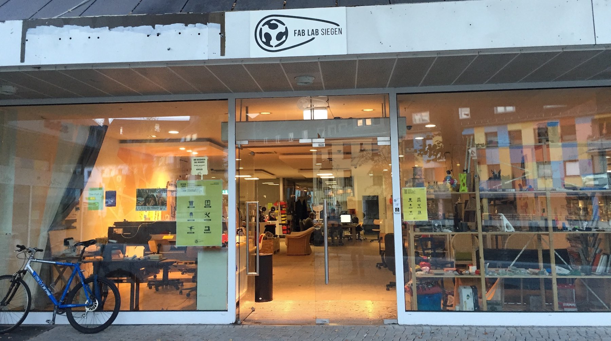
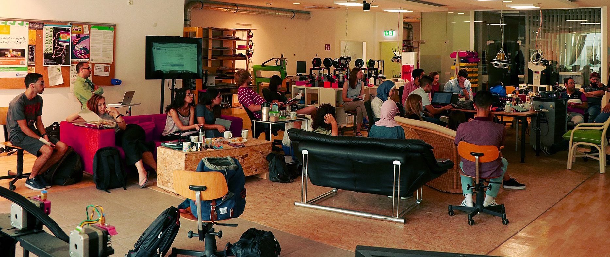
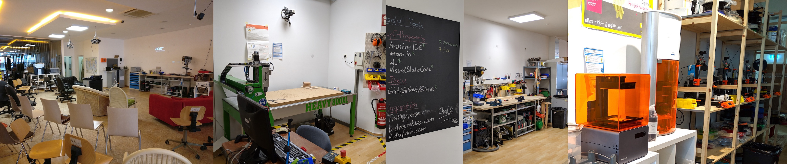

# Das Fab Lab Siegen

## Was wir tun

* Wir bieten offene Zeiten für alle und andere Gelegenheiten zum Lernen und zum Forschen  
* Wir sind ein "Reallabor eines Labors der Zukunft" für die Universität und die Region   
* Wir versuchen, flexiblen und vielfältigen Freiraum für Gestaltung zu schaffen und interessante Werkzeuge, Medien und Materialien zur Verfügung zu stellen 
* Wir versuchen, entstandenes Wissen möglichst offen zu teilen und (neue) Kooperationsmöglichkeiten zu schaffen   
* Wir werden unterstützt von einer Vielzahl von Menschen und Organisationen aus unserer Community, aus der Universität Siegen, aus der Region und aus der ganzen Welt
* Wir freuen uns über deine Kontaktaufnahme oder deinen Besuch! 

## Die Community

Das Fab Lab Siegen soll eine Infrastruktur für **alle** sein, die Interesse haben, sie zu nutzen, aktiv mitzugestalten, Veranstaltungen anzubieten oder in und mit dem Labor zu forschen und zu experimentieren. Wir freuen uns über wachsende, immer vielfältiger werdende Nachfrage, denn aus der Zusammenarbeit, dem Austausch und dem "Über-die-Schulter-Lernen" zwischen ganz unterschiedlichen Menschen und Organisationen entsteht der eigentliche Mehrwehrt, den so ein Fab Lab bieten kann.

## Der Ort

Wir sind dank Zusammenarbeit zwischen Universität und Stadt Siegen mitten im Stadtzentrum am [Campus Herrengarten](https://www.uni-siegen.de/start/kontakt/anfahrt_und_lageplaene/herrengarten.html) in einem ehemaligen Leerstand untergebracht. Dort haben wir große Flächen, viel Gestaltungsraum, Schaufenster und kommen täglich mit einem Querschnitt der Siegener Bevölkerung in Kontakt. 

Wir können die Räume bis zur Umsetzung [Projektes "Herrengarten"](https://www.siegen.de/leben-in-siegen/bauen-und-wohnen/staedtebaufoerderprojekt-herrengarten/projektinformation-freiflaeche-herrengarten/) der Stadt Siegen nutzen. Danach werden wir entweder an unseren früheren Haupt-Standort am [Campus Mitte](https://www.uni-siegen.de/start/kontakt/anfahrt_und_lageplaene/campus_siegen_mitte.html) im Keller des Ludwig-Wittgenstein-Hauses zurückziehen - oder hoffentlich einen neuen ähnlich großen und einladenden Standort wie am Herrengarten gefunden haben.

## Die Ausstattung

Wir haben verschiedenste Geräte, Maschinen und anderes Zubehör, das nach entsprechender Sicherheitsunterweisung genutzt werden kann. Unter anderem gibt's bei uns verschiedenste 3D-Drucker, Nähmaschinen, Hand- und Elektrowerkzeuge, einen Laser-Cutter, Fräsen und vieles mehr. Unter [Infrastruktur](/nutzen/infrastruktur.md) findet ihr eine genauere Übersicht. 

