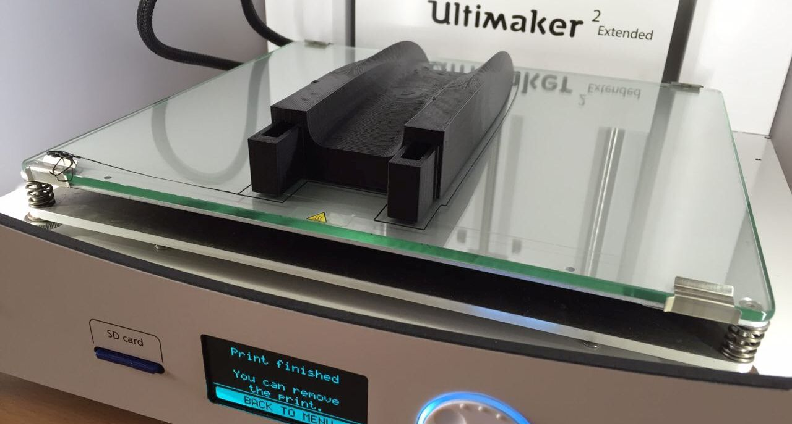

Ultimaker 2

**Notwendige Einweisungen:** [Allgemeine Sicherheitseinweisung](../../briefings-rules/Grundregeln/), [3D-Drucker](../../briefings-rules/Einweisung_3D-Drucker)

## Allgemeine Infos:

Feines Druckbild, großer Bauraum

[Handbuch (Deutsch)](https://ultimaker.com/download/3345/UserManual-UM2Extended-v1-DE.pdf)
[Kalibrierung](https://ultimaker.com/en/resources/168-calibration)
[Wartung](https://ultimaker.com/en/resources/174-cleaning-the-glass-plate)

## Materialien und Möglichkeiten:

## Tipps:
