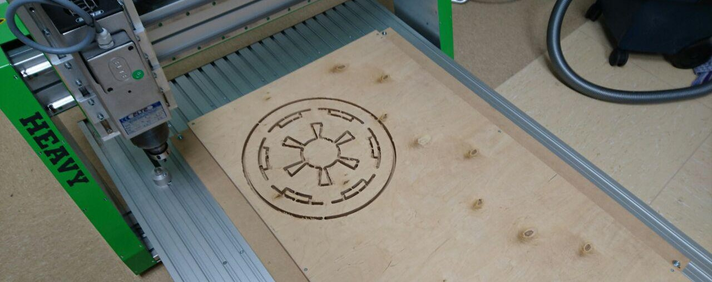
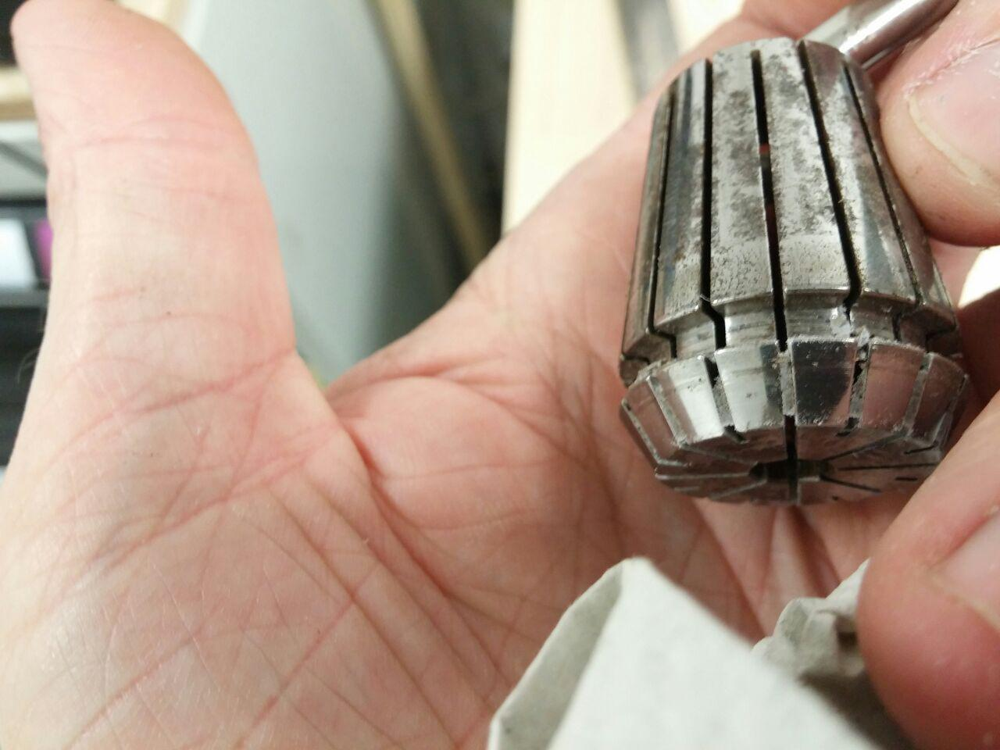
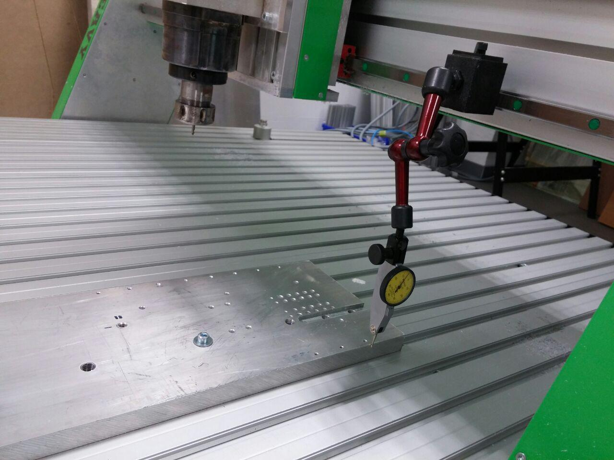

Portalfräse, 1500mm x 800mm x 170mm Verfahrweg. 2.2kW Spindel, auswechselbar mit Tangentialmesser (zum präzisen Schneiden dünner Materialien).

**Notwendige Einweisungen:** [Allgemeine Sicherheitseinweisung](!de/Einweisungen_und_Regeln/index), [Fräse](!de/Einweisungen_und_Regeln/Einweisung_Fräse/index)

## Basis-Infos
* Gerätehersteller: EAS, Typ Heavy 800XL [Herstellerlink](http://www.easgmbh.de/CNC-Maschinen/Fraesmaschinen/HEAVY/800XL)
* [Datenblatt](http://www.easgmbh.de/2015/PDF_Datenblaetter/1300,035_CNC_Maschine_HEAVY_800XL.pdf)
* Bedienungsanleitung des Herstellers: [PDF](anleitung_heavy.pdf)
* Steuerung: [Betriebsanleitung Pro Control](anleitung_heavy_steuerung.pdf)
* Software (Steuerung und Basis-CAM-Funktionen): NC-EASY Pro: [Kurzanleitung](http://www.easgmbh.de/2015/Downloads/CNC-Software/DOKU%20SMC5D.pdf), [vollständige Hilfe](http://www.easgmbh.de/2015/Downloads/CNC-Software/NC-EASY_Hilfe.pdf).

## Reinigung & Wartung

Funktionsflächen der Spannmutter bei jedem werkzeugwechsel sauber machen (ausblasen / alte Zahnbürste):

Spannzangen, insbesondere Schlitze sauber halten. So, wie auf dem folgenden Foto sollte das *nicht* aussehen:

Spindelkonus sauber halten (Finger / Lappen sollte sauber sein, nicht wie auf dem folgenden Bild):

## Werkstück ausrichten

Das Teil mit der Messuhr ist ein Fühlhebeltaster mit hydraulischer Zentralklemmung. Die Basis ist magnetisch (schaltbar). Aluplatte wurde grob ausgerichtet und die Fräse dann in der Y Achse am Werkstück entlanggefahren. Wenn der Zeiger still bleibt, ist das Werkstück parallel zur Maschinenachse ausgerichtet:

ToDo:
- Anleitungen und erste Projekte!
