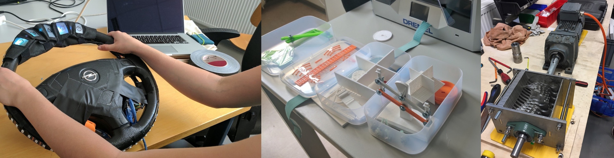
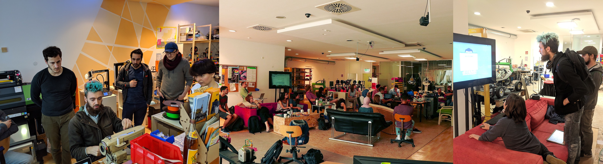

## Studentische / Bildungs-Projekte

Unser größter und meist nachgefragter Beitrag zur Lehre stellt die **Unterstützung studentischer Projekte** dar. Im Rahmen verschiedener Lehrveranstaltungen, Qualifizierungs- und Abschlussarbeiten kommen verschiedenste Studierende ins Fab Lab und werden dort beraten, in Maschinen und Methoden eingewiesen, mit Material ausgestattet, mit passenden Community-Mitgliedern vernetzt oder mit Arbeits- und Projektraum und anderweitig unterstützt. Sprecht uns an, wenn ihr Interesse habt! 

*Verschiedene Studierendenprojekte*

## Lehr-Forschung und experimentelle Lehre
Durch das Forschungsprojekt [FAB101](https://fab101.de) konnte mit verschiedenen Aspekten von Lehre und Bildung von Fab Labs im Hochschulkontext experimentiert werden. Einige der so im Fab Lab Siegen entstandenen Lehrformate könnten in Zukunft (wieder) angeboten werden: 

* Seminar "Einführung in Arduino": Vermittelt Handlungskompetenz in Bereichen wie Industrie 4.0-Sensorik/Aktorik und Internet of Things
* Seminar "3D-Druck": Einführung und Entwicklung Grundkompetenzen im 3D-Druck, Verständnis von Potenzialen und Limitierungen, stark projektorientiert
* Vorlesung + Übung "Einführung ins Fab Lab": Einführung in alle Arbeitsbereichen einer Digitalwerkstatt (z.B. 3D-Druck, Lasercutting, Programmierung) und Vorlesungsteil mit theoretischen Grundlagen

Für weitere Kooperationen im Bereich der Lehr-Forschung sind wir sehr offen. 

## Berufliche Aus-/Weiterbildung

Im Bereich der **beruflichen Aus- und Weiterbildung** besteht immer wieder Austausch und einzelne Zusammenarbeit mit Akteuren wie der IHK, den regionalen Berufskollegen, dem Berufsbildungszentrum oder einzelnen Ausbildungsbetrieben. Nach längeren Bemühungen um Fördermittel kann ab 2019 nun auch die Rolle von Fab Labs in der beruflichen Bildung insb. im Zusammenhang mit dem Technologie-Bereich 3D-Druck im Forschungsinfrastrukturprojekt [SmaP - Zentrum für Smart Production Design](https://www.uni-siegen.de/start/news/forschungsnews/814967.html) erprobt werden. 

## Offene Bildung

*Verschiedene Lehrformate* 

Außerhalb des Hochschulkontextes wird das Fab Lab regelmäßig von **Schulen und Bildungsträgern** angefragt und genutzt, die Exkursionen, Workshops oder Unterrichtseinheiten im und mit dem Fab Lab abhalten. Ähnliches gilt für den **außerschulischen Bildungsbereich**. Hier organisieren mittlerweile manche Gruppen auch regelmäßige Treffen im Fab Lab. Auch Praktika im Fab Lab Siegen finden statt (z.B. Schulpraktika, internationale Studienpraktika). 

Es finden regelmäßig **Bildungsworkshops für unterschiedliche Zielgruppen** im Fab Lab Siegen und bei Kooperationspartnern statt. Diese werden durch verschiedene Personen angeboten. Zum Beispiel durch Labor-Angestellte zu einer neuen Technologie im Fab Lab, durch BürgerInnen zu zu regionalen Initiativen, durch Studierende im Rahmen der Lehre), durch Gäste oder Partner beispielsweise aus Forschungsprojekten oder durch Community-Mitglieder zu zu eigenen Projekten oder Themen von persönlichem Interesse. 

