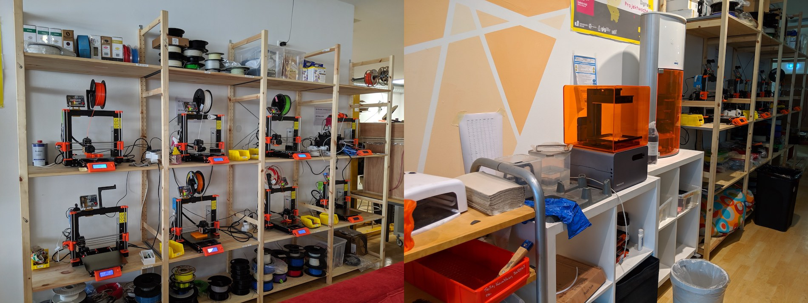
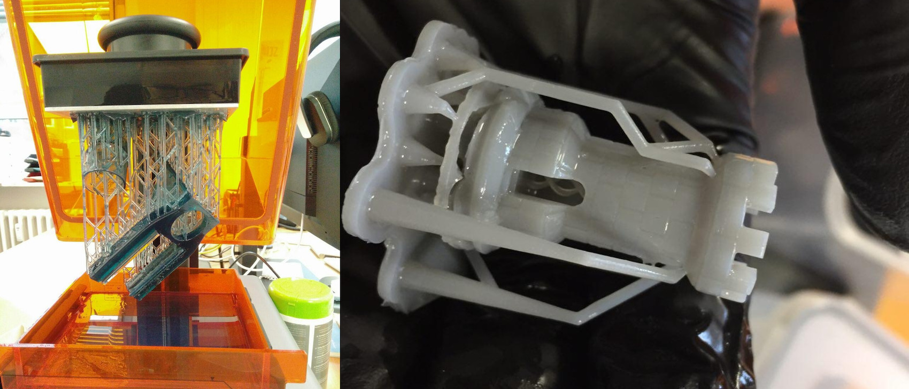
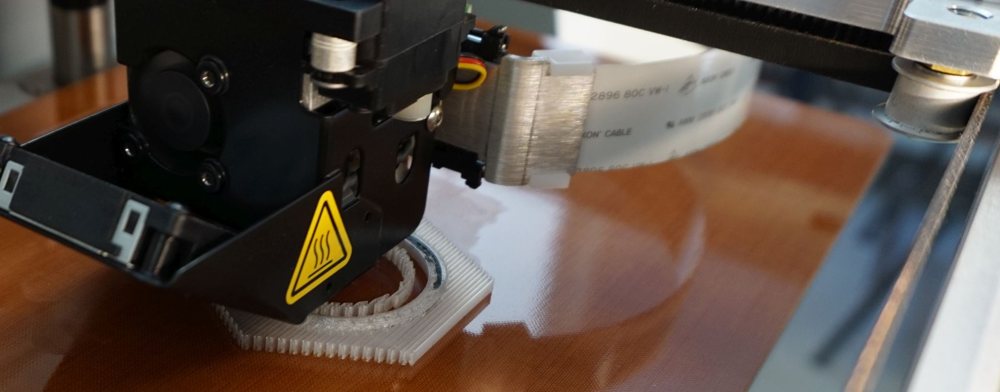

## FDM-Drucker

3D-Drucker, die nach dem [Fused Deposition Modeling-Verfahren](https://de.wikipedia.org/wiki/Fused_Deposition_Modeling) arbeiten. Sie können Teile aus verschiedenen Kunststoffen herstellen und sind vergleichsweise günstig und weit verbreitet. 

*Rechts FDM-Drucker, links zwei SLA-Drucker* 

Als Kontroll-Software für fast alle unserer FDM-Drucker lässt sich [PrusaSlicer](https://www.prusa3d.de/prusaslicer/) einsetzen. Alternativen sind z.B. [Cura](https://ultimaker.com/software/ultimaker-cura) und [Slic3r](https://slic3r.org/).

## SLA-Drucker

3D-Drucker, die nach dem [Stereolithografie-Verfahren](https://de.wikipedia.org/wiki/Fused_Deposition_Modeling) (SLA) arbeiten. És können Teile aus verschiedenen Kunststoffen hergestellt werden, die sehr detailliert und fein sind.  

- Unser Formlabs Form 1+ (wird vom Hersteller nicht mehr unterstützt, es muss daher eine [ältere Version](https://support.formlabs.com/s/article/Install-PreForm-Software?language=en_US#form1) der Kontroll-Software eingesetzt werden)
- Der Wasp TopDLP-Drucker ist experimentell, seine Software wird auf Anfrage bereitgestellt 

## Drucker mit Verbundmaterialien

Bei unseren beiden Druckern von Markforged handelt es sich um Geräte, die Kunststoff-Druck mit Fasermaterialien kombinieren. Es können so Objekte gedruckt werden, die ähnlich belastbar oder belastbarer als z.B. Aluminium sein sollen.

* Ein Blick auf die Herstellerwebsite (vor allem auch den Blog) ist empfehlenswert, um zu verstehen, was möglich sein könnte: [https://markforged.com](https://markforged.com/)
* Wir haben jeweils einen Mark One und einen Mark Two sowie genug Material vorrätig. 
* Das Anwendungspotenzial dieser Geräte für die Industrie, aber auch für Anwendungen jenseits von Prototyping für alle NutzerInnen ist riesig und noch nicht wirklich verstanden
* Menschen, die sich mit den Geräten befassen möchten, sind herzlich willkommen - allerdings müsst ihr dafür Erfahrung im 3D-Druck und die Bereitschaft, eure Erkenntnisse zu dokumentieren und zu teilen mitbringen
* Auf dem folgenden Foto sieht man einen der ersten Test-Drucke im Lab zu einem Zeitpunkt, zu dem der Drucker gerade von seiner Kunststoff-Düse (Nylon) auf die Faser-Düse gewechselt hat und eine Spur Carbonfasern druckt.

## SLS-Drucker

