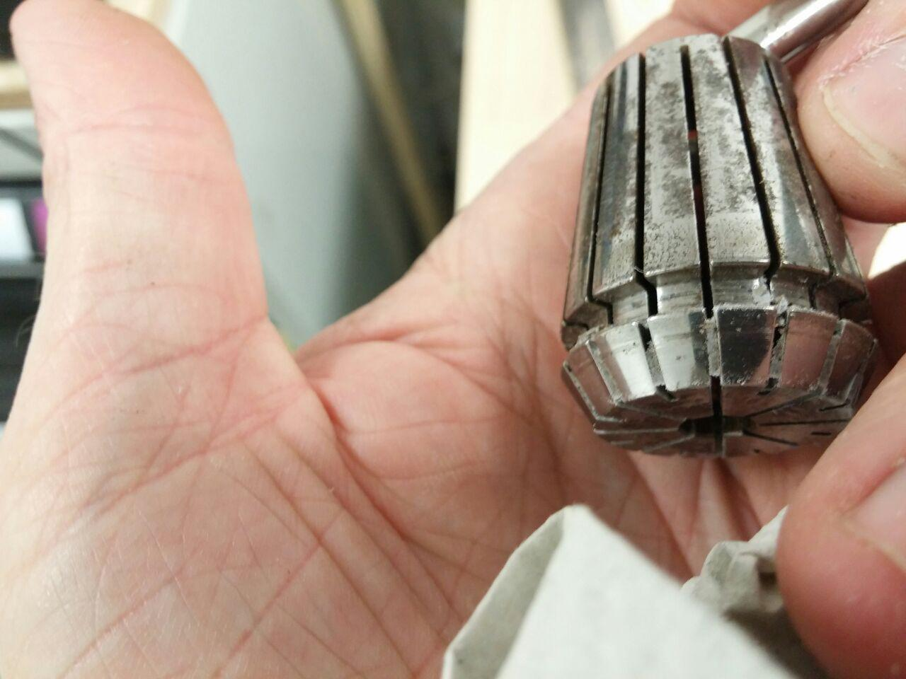
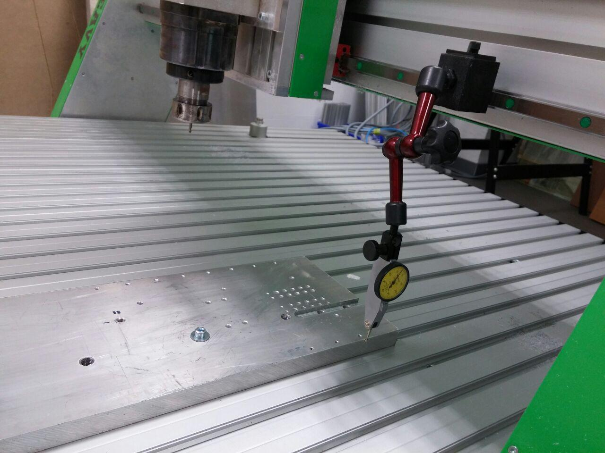

## CNC-Fräse EAS

* Portalfräse
* Arbeitsfläche 1500mm x 800mm x 170mm
* 2.2kW Spindel, auswechselbar mit Tangentialmesser (zum präzisen Schneiden dünner Materialien).
* Gerätehersteller: EAS, Typ Heavy 800XL [Herstellerlink](http://www.easgmbh.de/CNC-Maschinen/Fraesmaschinen/HEAVY/800XL)
* [Datenblatt](http://www.easgmbh.de/2015/PDF_Datenblaetter/1300,035_CNC_Maschine_HEAVY_800XL.pdf)

### Anleitungen 

* Bedienungsanleitung des Herstellers: [PDF](images/anleitung_heavy.pdf)
* Steuerung: [Betriebsanleitung Pro Control](images/anleitung_heavy_steuerung.pdf)
* Software (Steuerung und Basis-CAM-Funktionen) NC-EASY Pro: 
    * [Kurzanleitung](http://www.easgmbh.de/2015/Downloads/CNC-Software/DOKU%20SMC5D.pdf)
    * [Vollständige Hilfe](http://www.easgmbh.de/2015/Downloads/CNC-Software/NC-EASY_Hilfe.pdf).

### Reinigung & Wartung

Funktionsflächen der Spannmutter bei jedem Werkzeugwechsel sauber machen (ausblasen / alte Zahnbürste):

Spannzangen, insbesondere Schlitze sauber halten. So, wie auf dem folgenden Foto sollte das *nicht* aussehen:

Spindelkonus sauber halten (Finger / Lappen sollte sauber sein, nicht wie auf dem folgenden Bild):

## Werkstück ausrichten

Das Teil mit der Messuhr ist ein Fühlhebeltaster mit hydraulischer Zentralklemmung. Die Basis ist magnetisch (schaltbar). Aluplatte wurde grob ausgerichtet und die Fräse dann in der Y Achse am Werkstück entlanggefahren. Wenn der Zeiger still bleibt, ist das Werkstück parallel zur Maschinenachse ausgerichtet:

## Stämpfli-Fräse

The CNC Machine [Cutty](http://www.cutty.ch/index.html) from Steampfli. came with an old control board that had a serial connection and running  an old protocol that is hard to understand now. So we replace the board with an new one the [GBEL-NANO-Board](http://shop.myhobby-cnc.de/bausaetze/fraesen/114/grbl-nano-board?c=5) that  need an Arduino Nano to Work and can use with [GRBL](https://github.com/grbl/grbl) 0.8 and 1.x (We running GRBL 1.9). [GBEL](https://github.com/gnea/grbl/wiki) is "An open source, embedded, high performance g-code-parser and CNC milling controller [...] that will run on a straight Arduino". The way we recommend to communicate with the Board is [Chilipeppr](http://chilipeppr.com/grbl) (an Web application) but you can also use other Software.

## X-Carve

* Hersteller: Inventables
* [Bedienungsanleitung](http://x-carve-instructions.inventables.com/)
* [Internetplattform](http://easel.inventables.com) zur Steuerung der Fräse um einfache Weise und ohne zusätzliche Software zu arbeiten
* In der Websoftware stehen einfachste Formen wie Kreis, Rechteck, Dreieck, und Stern, aber es gibt auch eine Symboldatenbank (Smiley), Text mit verschiedenen Schriftarten, sowie zahlreiche Filter (Dogbone, Voronoi, Vektorisierung, Polygon, Zahnrad, Text im Kreis uvm.) zur Auswahl. Schlussendlich lassen sich extern erstellte SVG (skalierbare Pfaddateien) importieren.
* SVG Dateien erzeugt man mittels Layoutprogramm wie z.B. Inkscape oder Adobe Illustrator.
* Die CNC Fräse X-Carve lässt sich mit Bordmitteln nutzen, dazu bietet Inventables eine 
