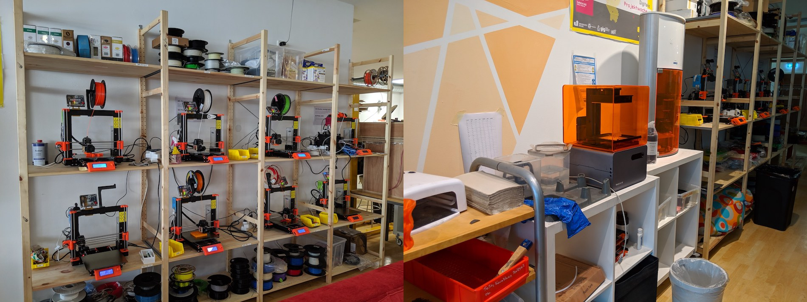

Fab Lab Siegen bietet an seinem aktuellen temporären Standort am Herrengarten ca. 200 Quadratmeter Gestaltungsraum in zentraler Lage, mit großer Schaufensterfläche und konstantem Kontakt zur Siegener Bevölkerung. 

#### Raum 
Der Raum ist u.a. ausgestattet mit Arbeitsmöglichkeiten für bis zu 30 Personen, Veranstaltungsfläche für bis zu 70 Personen und mehr, verschiedenen 3D-Druck-Technologien, Kreativbereichen/-ausstattung, CNC-Fräsen, IT-Infrastruktur, Literatur, Lasercutter, einer Elektrowerkstatt, Computern, Materialien, Nähmaschinen und Virtual Reality. Es gibt eine Küche, sanitäre Anlagen, Büro-/Arbeitsräume und Lagerflächen. 

*Karte diverser (Digital-)Labore in Siegen / Vergleich Fab Lab Siegen Herrengarten und frühere Räume im ehemaligen Stadtkrankenhaus)*

Größeren Plan des aktuellen Standorts am Herrengarten [als PDF herunterladen](/images/herrengarten-plan.pdf). 

#### 3D-Drucker

==TODO: Bild Beispiel-Drucke==

#### Schneiden und Fräsen

==TODO: Bild Schneid- und Fräsbeispiele==

#### Elektro-Werkstatt

#### Werkstatt / Elektrowerkzeuge

Wir haben zum Beispiel werkstattübliches Handwerkzeug, diverse Akkuschrauber und eine Standbohrmaschine, Nass-/Trockensauger, Bandschleifer, Kompressor, Winkelschleifer, Handkreissäge, Dremel, Handkreissäge, Heißklebepistolen, Dekupiersäge, Laminiergerät, Tiefziehgerät, Heißdrahtschneider, ... 

#### Lager 

Im Lab gibt's Projektboxen für Nutzer*Innen sowie ein gemischtes Material- und Zubehör-Lager

#### Sonstiges

Wir haben zum Beispiel verschiedene Notebooks (auch mobil in einem Koffer), Computer-Arbeitsplätze für Gestaltung, CAD, Medienarbeit und ähnliches, einen VR-Bereich (HTC Vive), einen Beamer, Kreativmaterial, Lego, diverses Bastelmaterial und - ganz wichtig - persönliche Schutzausrüstung für alle unsere Arbeitsbereiche. 
