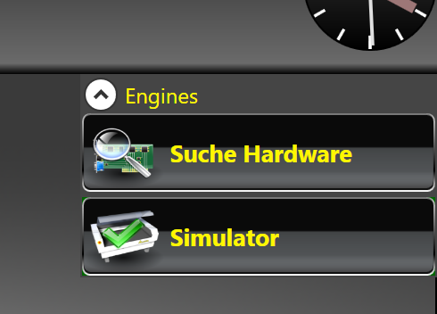
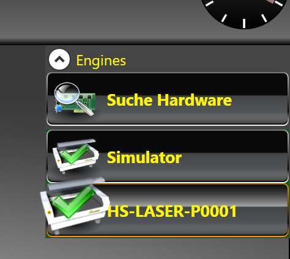
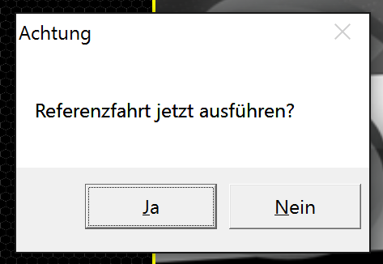
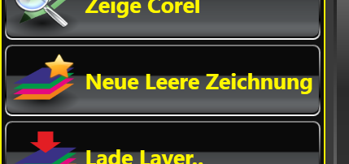
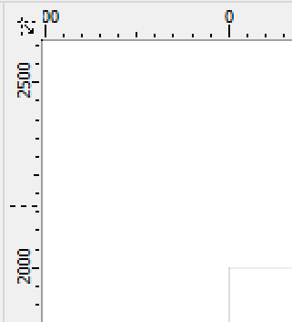
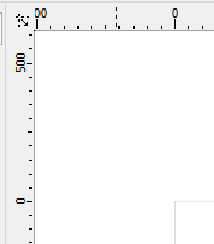
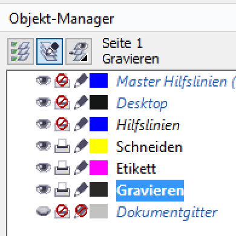
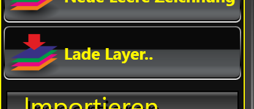
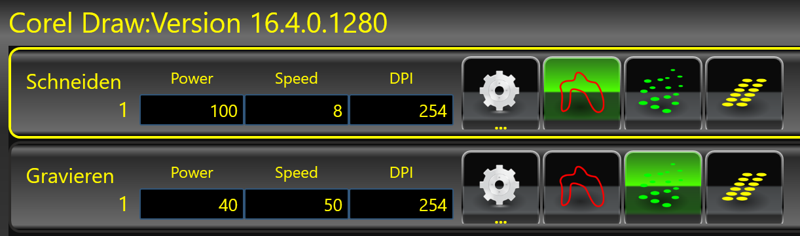
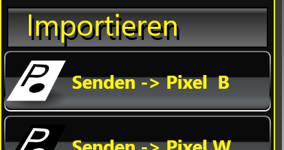

* Hersteller: EAS
* Bedienungsanleitung des Herstellers: [PDF](images/anleitung_laser.pdf)
* Zum Schneiden und Gravieren von Holz, Pappe, Acryl, ...

## Materialien und Parameter

zur Auswahl von Materialien und Parametern hat das Fab Lab München einen guten Artikel: 

https://wiki.fablab-muenchen.de/display/WIKI/6.+Materialien+und+Parameter

## How-To

### 1. Einschalten und verbinden
Einschalten der Maschine (Sicherung auf der Rückseite auf _ON_. Drücken auf den grünen Knopf vorne)

LaserLineX6-Software starten.

Nach Hardware suchen.

Gefundenen Laser auswählen.

Wenn die Nachfrage zur Referenzfahrt kommt, diese durchführen, wenn der Fahrraum frei und sicher ist!

### 2. Anlegen / Öffnen einer Zeichnung
Jetzt kann der Dialog für die Corel-Software geöffnet werden.

Die Laser-Software arbeitet eng mit Corel zusammen. In Corel geöffnete oder gezeichnete Grafiken können direkt in LaserLine ausgelesen und verarbeitet werden.

Zunächst wird eine neue, leere Zeichnung angelegt.

Danach per _Zeige Corel_ das Zeichenprogramm öffnen und anzeigen.

Hier ist zunächst zu beachten, dass der Nullpunkt nicht (wie bei der Arbeitsfläche des Lasers) oben links liegt.

Das führt dazu, dass nach dem Auslesen in LaserLine die Objekte außerhalb der Arbeitsfläche plaziert werden und erst umständlich verschoben werden müssen.

Indem wir das _Koordinatenursprungssymbol_ oben links per Drag and Drop an die gewünschte Stelle ziehen kann der Ursprung nach oben links in die Zeichnung gelegt werden.

In der leeren Zeichnung existieren bereits mehrere Ebenen. Hiervon berücksichtigt LaserLine beim Auslesen nur die beiden (im Bild bereits umbenannten) Ebenen _Schneiden_ und _Gravieren_.

Manuell neu erstellte Ebenen werden allerdings ebenfalls durch LaserLine ausgelesen.

Jetzt kann man die gewünschte Zeichnung anfertigen, importieren etc.
Zu beachten ist, dass Objekte die mit unterschiedlicher Geschwindigkeit oder mit unterschiedlicher Stärke gelasert werden sollen, sich auf jeden Fall in unterschiedlichen Ebenen befinden müssen. Alle Laser-Parameter lassen sich immer nur pro Ebene festlegen.

Weiterhin ist wichtig, dass mehrene Objekte innerhalb einer Ebene vor dem Auslesen durch LaserLine kombiniert werden müssen!

Ohne kombinieren wird jeweils nur das erste Objekt pro Ebene ausgelasert!

### 3. Auslesen, Parametrisieren, Verarbeiten
Ist die Zeichnung in Corel fertig, wechseln wir zurück nach LaserLine.

Hier klicken wird _Lade Layer..._ um die Ebenen aus Corel auszulesen.

Rechts sehen wir nun die Ebenen aus Corel.

Ist die Zahl unterhalb des Ebenennamens größer als 1, müssen die Objekte innerhalb der Ebene in Corel noch kombiniert werden! (Siehe Ende von Schritt 2)

Die Parameter für Power und Speed müssen jetzt je nach Material und gewünschter Verarbeitung angepasst werden. Mit den Schaltflächen hinter den Textfeldern wird festgelegt, ob die Ebene geschnitten oder gerastert (zum Gravieren) wird.

Sind alle Parameter eingestellt, kann alles verarbeitet werden. Hierzu klickt man auf _Senden -> Pixel B_.

Die dann folgende Verarbeitung kann je nach Größe / Komplexität der Zeichung sehr lange dauern!

### 4. Ausrichten und Lasern
