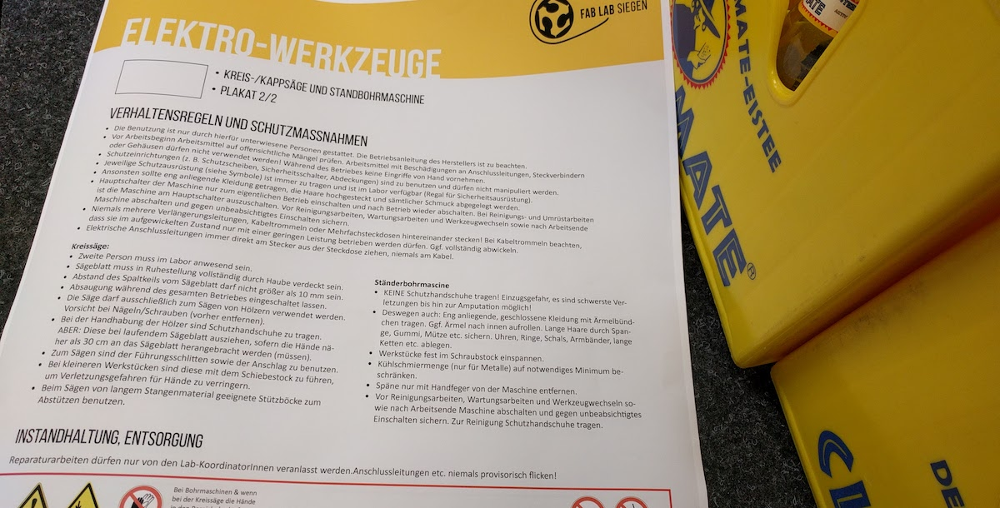

Seit September 2018 gibt es in unserem Fab Lab an jedem ersten und an jedem dritten Donnerstag des Monats ab 16 Uhr Sicherheits-Einweisungen, die in die [Laborordnung](../ressourcen/laborordnung.md) einführen und die Grundlage für das selbständige Arbeiten im Lab darstellen. Ohne Einweisung, also z.B. als Gast, darf im Fab Lab grundsätzlich nicht aktiv gearbeitet werden. Führungen, Teilnahme an Vorträgen, Arbeiten mit dem eigenen Laptop o.Ä. sind hiervon ausgenommen.

### Was ist eine Sicherheitsunterweisung bzw. wofür brauche ich sie?

Eine Sicherheitsunterweisung macht möglich, dass man an den Maschinen bzw. den Arbeitsbereichen, an denen man eingewiesen wurde, selbständig arbeiten kann.

### Welche Einweisungen gibt es und worum geht es da?

#### Allgemeine Sicherheitseinweisung
Diese Einweisung brauchst du, um das Labor für allgemeine Tätigkeiten zu nutzen, die über "als Gast anwesend sein" hinausgehen. Auch Handwerkzeug kann nach dieser Einweisung genutzt werden. 

!!! info
    [Sicherheits-Poster für Allgemeine Sicherheitseinweisung als PDF herunterladen](images/safety-instructions-green.pdf)

#### Einweisungen für die selbständige Nutzung
Es gibt Arbeitsbereiche und Geräte im Fab Lab, die eine gesonderte Einweisung benötigen, danach aber selbständig bzw. immer selbständiger genutzt werden kann. Aktuell fallen darunter:

* 3D-Drucker
* Elektro-Werkzeuge
* Die Elektro-Werkstatt
* Der Lasercutter

!!! info
    [Sicherheits-Poster für Bereiche zur selbständigen Nutzung als PDF herunterladen](images/safety-instructions-yellow.pdf)

#### Einweisungen für besondere/gefährliche Bereiche
Bestimmte Geräte sind als besonders gefährlich, empfindlich, teuer oder anderweitig besonders eingestuft und dürfen daher nur nach Einweisung und nach Absprache vor jeder Nutzung mit dem Personal genutzt werden: 

* CNC-Fräsen
* Kreissäge(n)
* SLS- und Markforged-Drucker

!!! info
    [Sicherheits-Poster für besondere/gefährliche Bereiche als PDF herunterladen](images/safety-instructions-red.pdf)**

### Für wen sind Sicherheitsunterweisungen?

Prinzipiell kann jede und jeder Interessierte ab 14 Jahren an einer Sicherheitsunterweisung teilnehmen. Für Teilnehmerinnen und Teilnehmer unter 18 ist - wie auch ganz allgemein für die Nutzung des Labs - die Einwilligung eines Erziehungsberichtigten sowie eine Absicherung der Aufsichtspflicht nötig.

### Was kostet die Sicherheitsunterweisung?

Die Sicherheitsunterweisung ist für alle Teilnehmerinnen und Teilnehmer kostenlos.

### Wie lange dauert eine Sicherheitsunterweisung?

Die allgemeine Sicherheitseinweisung dauert 60-90min. Wie lange die anderen Einweisungen dauern, ist individuell. 

### Und wann kann ich dann an den Maschinen loslegen?

Um an den Maschinen arbeiten zu können, besucht uns bitte Freitags zu den Open Lab-Zeiten. Normalerweise also ab 14 Uhr, wenn wir nichts anders angekündigt haben. Mehr Details unter "Kontakt". 

### Muss ich mich anmelden?

Nein. Eine Anmeldung ist nicht erforderlich. Kommt am ersten oder dritten Donnerstag im Monat pünktlich um 16 Uhr ins Labor. Mitarbeiterinnen und Mitarbeiter sind an diesen Tagen im Labor und legen dann gemeinsam mit den anwesenden Interessierten das Programm für die jeweilige Einweisung fest. 

