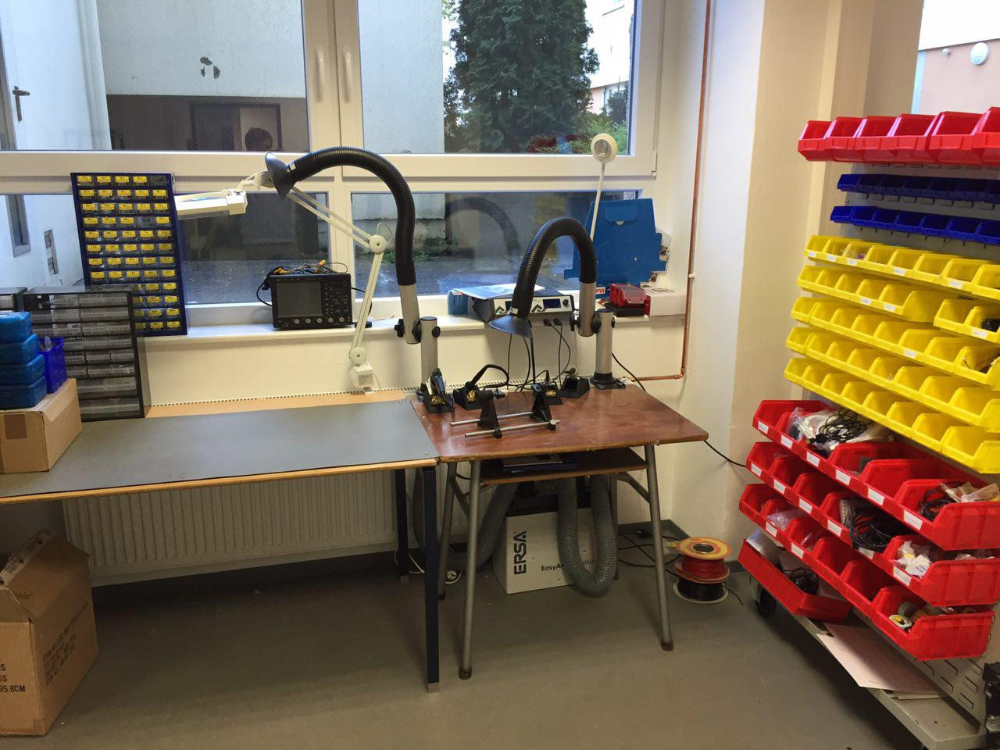

Bereich für Elektronik-Arbeiten.

**Notwendige Einweisungen:** [Allgemeine Sicherheitseinweisung](!de/Einweisungen_und_Regeln/Grundregeln/index), [Elektronik-Bereich](!de/Einweisungen_und_Regeln/Einweisung_E-Werkstatt/index)

### Equipment

- Lötstation Ersa i-CON VARIO 4 [(Herstellerlink)](http://www.i-con-vario.de/i-con-vario/i-con-vario-4.html) + 2x Lötkolben 150W + 1x [Heißluftlöten](http://www.i-con-vario.de/vario-tools/i-tool-air-s.html) + 1x [Entlötwerkzeug](http://www.i-con-vario.de/vario-tools/x-tool.html)
- Lötrauchabsaugung Ersa
- Labornetzteil
- Oszilloskop
- Diverse Handmultimeter, vor allem [diese](http://www.tme.eu/de/details/bm257/tragbare-digitalmultimeter/brymen/bm257s/)
- Bauteile-Lager
- Diverse Microcontroller / Einplatinencomputer und zugehörige Komponenten
- Diverse Geräte zum Ausschlachten
- Die CNC-Fräsen können auch zum Isolationsfräsen von Platinen verwendet werden. Besser ausgestattet und erfahrener ist hierfür aber das studentische [eLab](http://elab.eti.uni-siegen.de/eLab/?elabor).

### Bedarfe:
- Workshop- und Lehr-Set aus Microcontrollern (vor allem BBC micro:bit und Arduinos plus ausgewählte zugehörige Bauteile)
- Evtl. ein weiteres, kleines Labornetzteil
- Bauteile

### ToDo zu diesem Dokument:
- Ergänzen, aufhübschen (Tabelle?)
- Hersteller-Infos
- Fotos
- Ggf. weiteren Bedarf durchdenken und ergänzen
