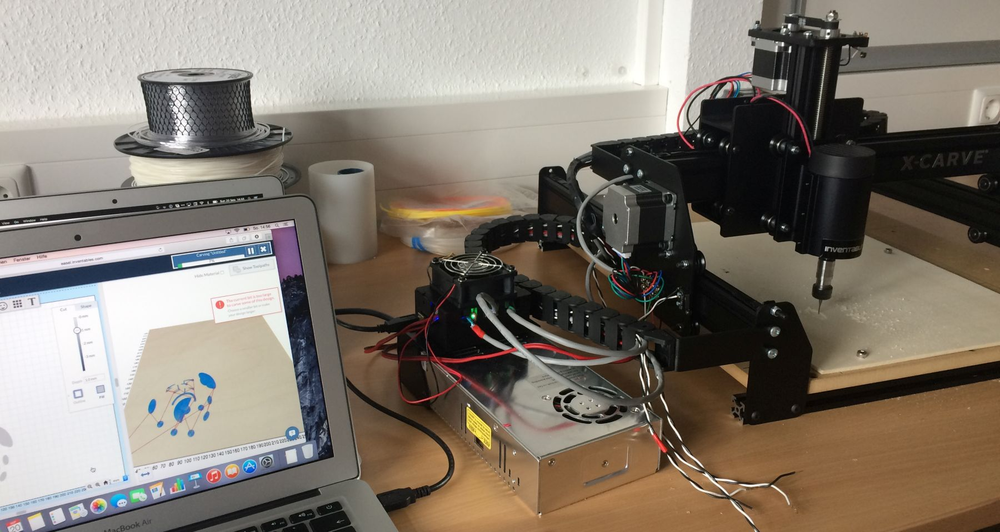

**Notwendige Einweisungen:** [Allgemeine Sicherheitseinweisung](!de/Einweisungen_und_Regeln/index), [Fräsen](!de/Einweisungen_und_Regeln/Einweisung_Fräse/index)

* Hersteller: Inventables
* [Bedienungsanleitung](http://x-carve-instructions.inventables.com/)

Zur Nutzung benötigt werden:
* Ein Computer mit Windows oder Mac
* Ein USB Kabel zur Verbindung des Computers mit dem X-Carve (liegt an der Fräse)
* Eine Internetverbindung
Treiber (downloadbar über die Webseite)
* Ein Werksstück (z.B. Holz, Acryl, Aluminium)

In der Websoftware stehen einfachste Formen wie Kreis, Rechteck, Dreieck, und Stern, aber es gibt auch eine Symboldatenbank (Smiley), Text mit verschiedenen Schriftarten, sowie zahlreiche Filter (Dogbone, Voronoi, Vektorisierung, Polygon, Zahnrad, Text im Kreis uvm.) zur Auswahl. Schlussendlich lassen sich extern erstellte SVG (skalierbare Pfaddateien) importieren.

SVG Dateien erzeugt man mittels Layoutprogramm wie z.B. Inkscape oder Adobe Illustrator.

Die CNC Fräse X-Carve lässt sich mit Bordmitteln nutzen, dazu bietet Inventables eine [Internetplattform](http://easel.inventables.com) um einfache Weise und ohne zusätzliche Mittel zu fräse
