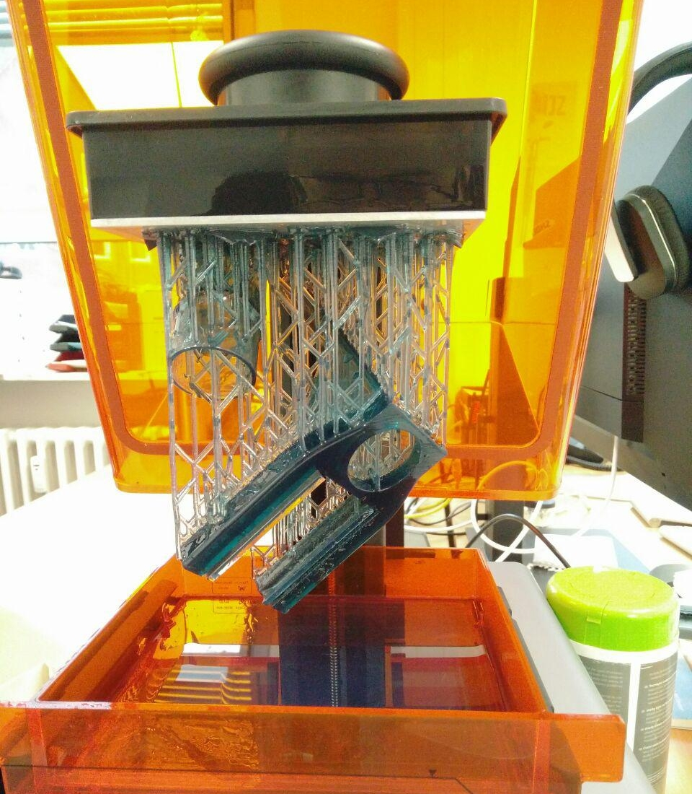

Formlabs Form 1+ 

**Notwendige Einweisungen:** [Allgemeine Sicherheitseinweisung](!de/Einweisungen_und_Regeln/Grundregeln/index), [3D-Drucker](!de/Einweisungen_und_Regeln/Einweisung_3D-Drucker/index)

## Allgemeine Infos:
- Formlabs Form 1+ [(Herstellersupport)](https://support.formlabs.com/hc/en-us/categories/115000003004)

## Materialien und Möglichkeiten:

## Tipps:

### Bedarfe:
- Wechsel-Becken für verschiedene Materialien
