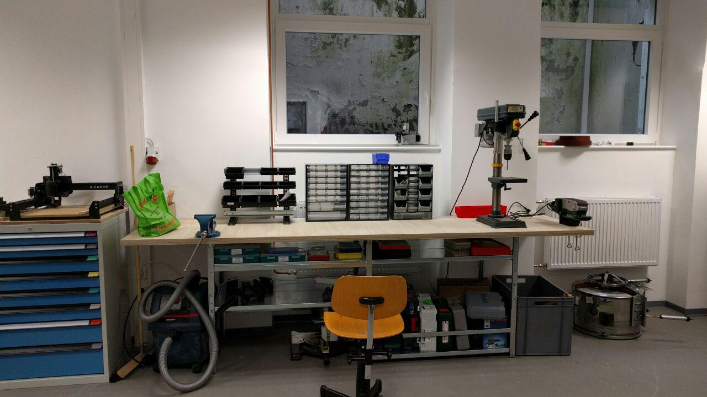

Manuell zu bedienende Elektrogeräte / -Werkzeuge.

**Notwendige Einweisungen:** [Allgemeine Sicherheitseinweisung](!de/Einweisungen_und_Regeln/Grundregeln/index), [Elektrowerkzeuge](!de/Einweisungen_und_Regeln/Einweisung_Elektro-Werkzeuge/index)

## Im Lab vorhanden

- Akkuschrauber Festool CXS
- Standbohrmaschine
- Kapp-, Gehrungs- und Tischkreissäge [(Herstellerlink)](http://de.ryobitools.eu/elektrowerkzeuge/halbstationare-gerate/rtms1800/rtms1800-g/)
- Nass-/Trockensauger [(Herstellerlink)](https://www.bosch-professional.com/de/de/gas-25-l-sfc-6152-ocs-p/)
- Bandschleifer (kann stationär montiert werden) [(Herstellerlink)](https://www.bosch-do-it.de/de/de/bosch-elektrowerkzeuge/werkzeuge/pbs-75-ae-3165140633185-199910.jsp)
- Kompressor (+20m Schlauch, Ausblaspistole, [(Druckluftnagler)](http://www.prebena.de/article/produkte/12-xr-serie-und-workline-set/288-2xr-es40)) [(Herstellerlink)](http://www.prebena.de/article/produkte/13-kompressoren/10-vigon-240)
- Flex Bosch Grün
- Dremel, Werkzeuge allerdings aktuell eher unvollständig
- Heißklebepistolen
- Dekupiersäge Proxxon [(Herstellerlink)](http://www.proxxon.com/de/micromot/28092.php)

### Bedarfe:
- Größerer Akkuschrauber
- Schweißgerät
- Bandsäge
- Gute Bohrer (derzeit eher Standardware mit Qualität "OK" vorhanden wegen Lehr-Einsatz)
- Bei intensiverer Nutzung von Fräsen, Schleifern, etc. könnten eine größer dimensionierte Absauganlage, Spänefang, etc. sinnvoll sein

### ToDo
- Ergänzen, aufhübschen (Tabelle?)
- Hersteller-Infos
- Fotos
- Ggf. weiteren Bedarf durchdenken und ergänzen
