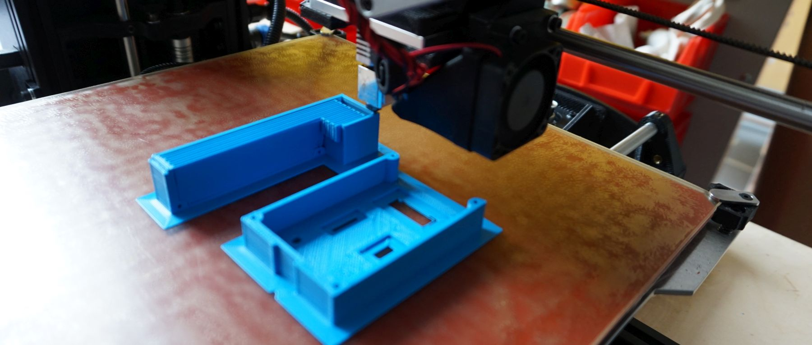
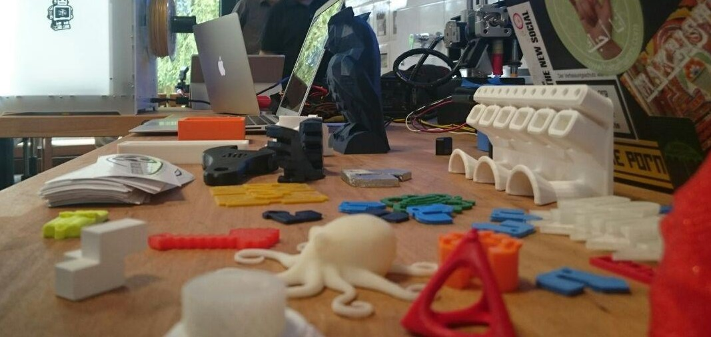

3D-Drucker, die nach dem [Schmelzschicht-Verfahren](https://de.wikipedia.org/wiki/Fused_Deposition_Modeling) (engl. Fused Deposition Modeling, FDM) arbeiten. Das sieht so aus:

**Notwendige Einweisungen:** [Allgemeine Sicherheitseinweisung](!de/Einweisungen_und_Regeln/Grundregeln/index), [3D-Drucker](!de/Einweisungen_und_Regeln/Einweisung_3D-Drucker/index)

## FDM- Drucker im Lab

Gerät |  Eigenschaften  
------|:---------------:
[Ultimaker 2 Extended](Ultimaker) | Feines Druckbild, großer Bauraum
[Lulzbot TAZ 5](LulzBotTAZ5) | Größter Bauraum, Druck mit zwei Materialien
[Printrbot Simple Metal](PrintrBot) | Kompakt, robust
[Aya](Aya) | Delta-Drucker, Eigenbau, sehr schnell
[Tiko](#tiko) | Delta-Drucker, noch in Beschaffung 
[Makerbot Replicator Dual](ReplicatorDual) | Druck mit zwei Materialien 
[Makerbot Replicator 2X](Replicator2X) | Druck mit zwei Materialien, Sailfish 
[Markforged Mark One](MarkOne) | Industriequalität mit optionaler Faserverstärkung
[Markforged Mark Two](MarkTwo) | Industriequalität mit optionaler Faserverstärkung

## Materialien und Möglichkeiten

Infos folgen

## Ultimaker 2 Extended 

## Lulzbot TAZ 5 

## Aya 

- Eigenbau
- Funktionsprinzip: [Delta Robot](https://en.wikipedia.org/wiki/Delta_robot)
- [Dokumentation](!de/Projekte/Aya)

## Printrbot Simple Metal 

## Tiko 

## Makerbot Replicator dual 

## Makerbot Replicator 2x 

## Bedarfe
- Verbrauchsmaterialien (jede Menge)
- Vorrat an Ersatz- / Verbrauchsteilen

## ToDo

- Genauere Auflistung, insb. "seltenere" Werkzeuge, soweit vorhanden
- Fotos
- Bedarfe ergänzen
