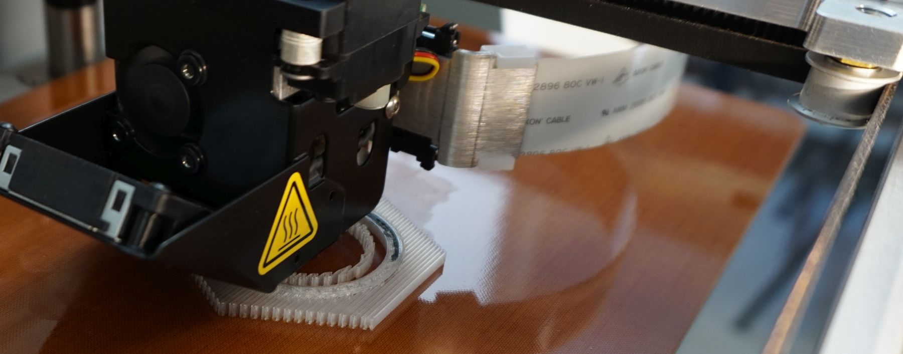

Neue Drucker, die per FDM Kunststoffe mit Fasermaterialien kombinieren. Es können so Objekte gedruckt werden, die ähnlich belastbar oder belastbarer als z.B. Aluminium sein können.

**Notwendige Einweisungen:** [Allgemeine Sicherheitseinweisung](!de/Einweisungen_und_Regeln/Grundregeln/index), [3D-Drucker](!de/Einweisungen_und_Regeln/Einweisung_3D-Drucker/index), zusätzlich vorerst Erfahrung mit 3D-Druck und Maschinen sowie Absprache mit der Lab-Koordination erforderlich.

## Infos

Ein Blick auf die Herstellerwebsite (vor allem auch den Blog) ist empfehlenswert, um zu verstehen, was möglich sein könnte: https://markforged.com/

Das Anwendungspotenzial dieser Geräte für die Industrie, aber auch für Anwendungen jenseits von Prototyping für alle NutzerInnen ist riesig und noch nicht wirklich verstanden. Menschen, die sich mit den Geräten befassen möchten, sind herzlich willkommen - allerdings müsst ihr dafür Erfahrung im 3D-Druck und die Bereitschaft, eure Erkenntnisse zu dokumentieren und zu teilen mitbringen. Auf dem folgenden Foto sieht man einen der ersten Test-Drucke im Lab zu einem Zeitpunkt, zu dem der Drucker gerade von seiner Kunststoff-Düse (Nylon) auf die Faser-Düse gewechselt hat und eine Spur Carbonfasern druckt.

Wir haben jeweils einen Mark One und einen Mark Two sowie genug Nylon, Glasfaser, Hochtemperatur-Glasfaser, Kevlar und Carbon vorrätig. Das neue Material "Onyx" soll zum Wintersemester beschafft werden.

### Bedarfe:
- Verbrauchsmaterial (zum WS, aktuell genug vorhanden)

### ToDo:
- Erfahrungen sammeln
- Experimentelle Teile drucken, die die Fähigkeiten der Geräte ausnutzen
- Dokumentation erstellen
- Workshop im WS organisieren?
