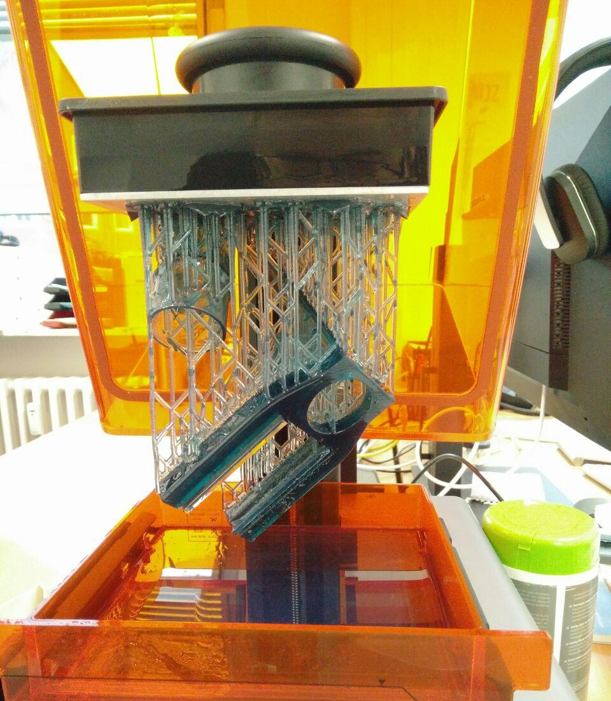
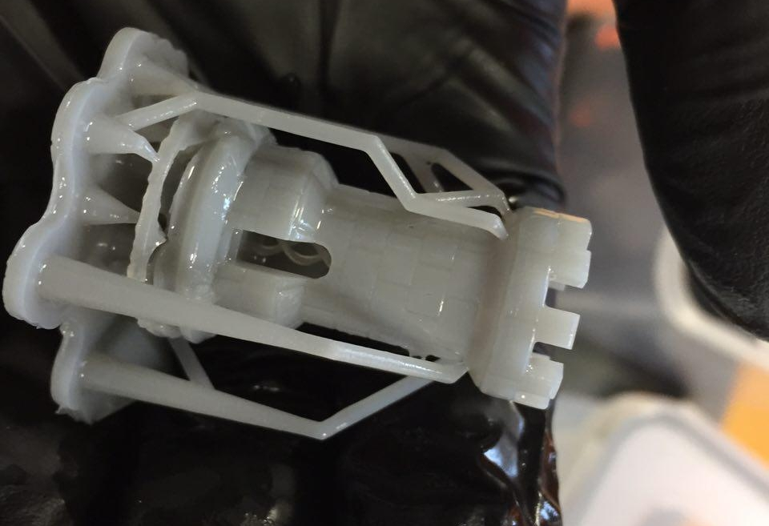

3D-Drucker, die nach dem [Stereolithografie-Verfahren](https://de.wikipedia.org/wiki/Fused_Deposition_Modeling) (SLA) arbeiten.És können Teile aus verschiedenen Kunststoffen hergestellt werden, die sehr detailliert und fein sind.  

**Notwendige Einweisungen:** [Allgemeine Sicherheitseinweisung](!de/Einweisungen_und_Regeln/Grundregeln/index), [3D-Drucker](!de/Einweisungen_und_Regeln/Einweisung_3D-Drucker/index)

## SLA-Drucker im Lab:

- Formlabs Form 1+ [(Herstellersupport)](http://formlabs.com/support/printers/form-1/get-ready-receive-your-printer/)

Fertiger Druck vor dem Entfernen der Stützmaterialien

### Bedarfe:
- Wechsel-Becken für verschiedene Materialien

### ToDo zu diesem Dokument:
- Ergänzen, aufhübschen
- Hersteller-Infos, Tutorials, Tipps
- Fotos
- Ggf. weiteren Bedarf durchdenken und ergänzen
