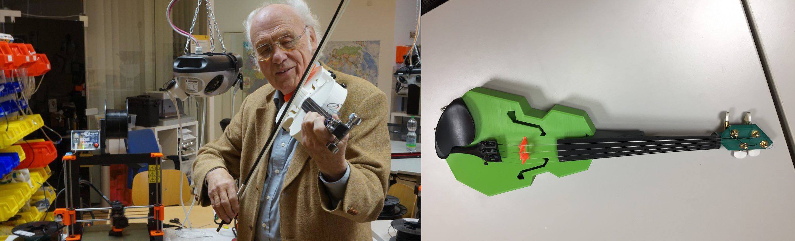
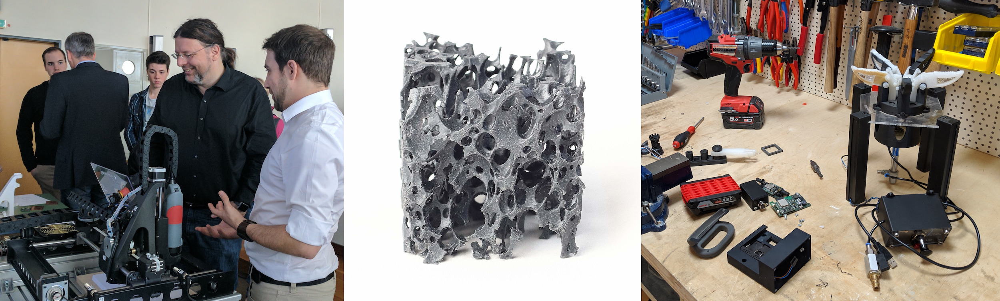

## Angebote für alle
Community, Infrastruktur und Angebote des Fab Lab bieten einen quer durch die Bevölkerung zugänglichen, unmittelbaren Mehrwert für die Region. Wir bieten rege nachgefragte offene Labor-Zeiten für alle, Zugang zu interessanten Geräten, Einweisungen, Hilfestellungen und Gestaltungsraum für Menschen. Als Projekt ist das Fab Lab Siegen so ein unmittelbar wirksames Beispiel für die Potenziale guter öffentlicher und öffentlich-privater Partnerschaften und steht für die Zusammenarbeit von BürgerInnen, Hochschule, Stadt, Firmen und weiteren Partnern. 

## Dienstleistungen
Auf regionaler Ebene werden von verschiedenen Organisationen wie  Bibliotheken oder Schulen und Unternehmen wirtschaftliche Dienstleistungen beim Fab Lab Siegen angefragt. Dies betrifft insbesondere Beratungen,  Schulungs- und Qualifizierungswünsche sowie Forschung, Entwicklung und (Einzel-)Fertigung, aber auch Eventformate oder den Wunsch nach Co-Working-Möglichkeiten. Wir sind, bedingt durch unsere Struktur in der öffentlichen Hand, nicht immer in der Lage, allen Wünschen zu entsprechen. Manchmal sind Vorhaben dieser Art aber auch umsetzbar und wir freuen uns auf jeden Fall immer über das Interesse und über die interessanten Dialoge, die sich hier normalerweise ergeben. Sprechen Sie uns gern an! 

*Beispiele für regionale Kooperationen, z.B. in F&E sowie Aus-/Weiterbildung*

## Regionalentwicklung & Kommunikation 
Als "Fenster in die Uni" und als "Labor der Digitalisierung" fügt sich das Fab Lab in regionale Strategien ein und unterstützt die Außendarstellung der Partner, beispielsweise im Zusammenhang mit dem Umzug der Uni Siegen in die Stadt, mit der [Stadtentwicklung am Herrengarten](https://www.siegen.de/leben-in-siegen/bauen-und-wohnen/staedtebaufoerderprojekt-herrengarten/), dem [Regionalentwicklungskonzept Siegen-Wittgenstein](https://www.siegen-wittgenstein.de/Kreisverwaltung/Themen-und-Projekte/Regionales-Entwicklungskonzept) sowie den Transfer- und Digitalisierungskonzepten der Hochschule. 

## Projektförderungen für die Region

Seit Projektbeginn sind deutlich mehr Drittmittel aus Bundes-, Landes- und anderen Förderrichtlinien in Zusammenhang mit dem Fab Lab für die Region eingeworben worden als Kosten verursacht wurden. Über Drittmittelprojekte werden Forschungsvorhaben umgesetzt sowie regionale Schwerpunktthemen fokussiert - und neue Arbeitsstellen in der Region für junge Forscher*Innen und wissenschaftsunterstützendes Personal in der Region geschaffen. 