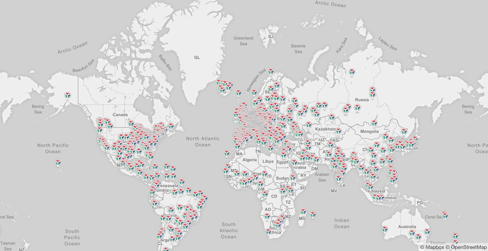

Fabrikationslabore - _Fabrication Laboratories, Fab Labs_ - existieren und entstehen weltweit, wobei es mittlerweile über 1500 solcher Organisationen gibt. Jedes der Labore ist eine regionale Plattform und Infrastruktur für Kreativität und ein Teil des weltweiten Netzwerkes. 

> "What is a Fab Lab?" "A Fab Lab is a technical prototyping platform for innovation and invention, providing stimulus for local entrepreneurship. A Fab Lab is also a platform for learning and innovation: a place to play, to create, to learn, to mentor, to invent. To be a Fab Lab means connecting to a global community of learners, educators, technologists, researchers, makers and innovators - a knowledge sharing network that spans 30 countries and 24 time zones. Because all Fab Labs share common tools and processes, the program is building a global network, a distributed laboratory for research and invention."  
> **[- The Global Fab Foundation](http://www.fabfoundation.org/index.php/what-is-a-fab-lab/index.html)**

## \(Maker-\)Kulturen

In Fab Labs geht es zwar auch um Technik, vor allem aber geht es um Menschen, um Kooperation und um Kreativität. Konzeptuell eng verbunden mit Fab Labs ist die aktuell auch medial diskutierte "Maker-Kultur" \(eine Renaissance des Do-It-Yourself, u.a. auf Basis digitaler Technologien und digital wie offline vernetzter Community-Strukturen\) sowie zahlreiche andere artverwandte Strömungen zwischen Technik, Kultur und Arbeit. Beispiele hierfür sind die Hacker-Szene, mit der Fab Labs den kreativen Umgang mit Technologie und bestimmte Werte teilen genauso wie Teile der Dialoge um Arbeit 4.0 und Industrie 4.0 oder auch die Startup-/Entrepreneurship-Szene, wo mittlerweile häufig mit Fab Lab-artigen Strukturen unter Labels wie z.B. "Innovation-Hubs" gearbeitet wird.

> "Hackspaces are community-operated physical places, where people can meet and work on their projects."  
> **[- hackspaces.org/](https://hackspaces.org/)**

## Digitale Fabrikation

„Digitale Fabrikation“ bezeichnet computergesteuerte Fertigungsmethoden wie z.B. CNC-Fräsen oder 3D-Drucken, beinhaltet aber auch den selbstverständlichen Umgang mit Microcontrollern, Sensorik und Aktorik, Softwarekomponenten, Nutzung von Open Source und anderen Möglichkeiten der digitalen \(weltweiten\) Zusammenarbeit.

> "just as we have digitised communication and computing, we must digitise fabrication by learning how to program the growth of materials so that the code you put into them doesn't just describe them but becomes the materials themselves. Digitisation of fabrication is where you don't just digitise design, but the materials and the process. The computer program doesn't just describe the thing but becomes the thing."  
> **[- WIRED Magazine, 2013: Digital Fabrication is so much more than 3D printing](http://www.wired.co.uk/article/digital-fabrication)**

