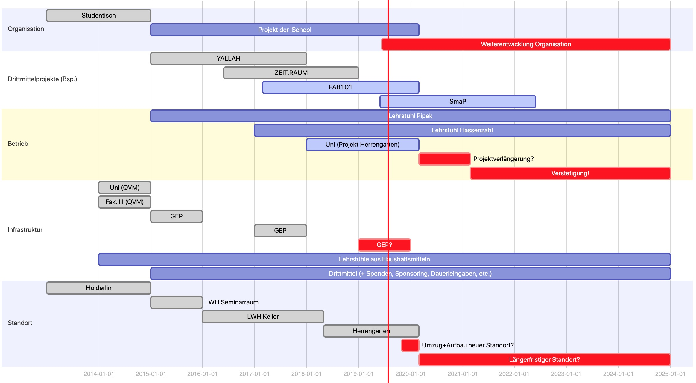
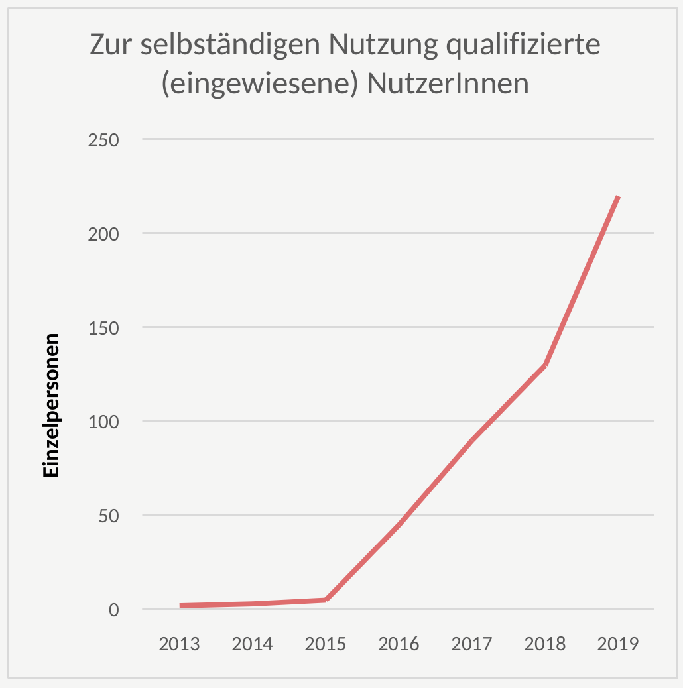
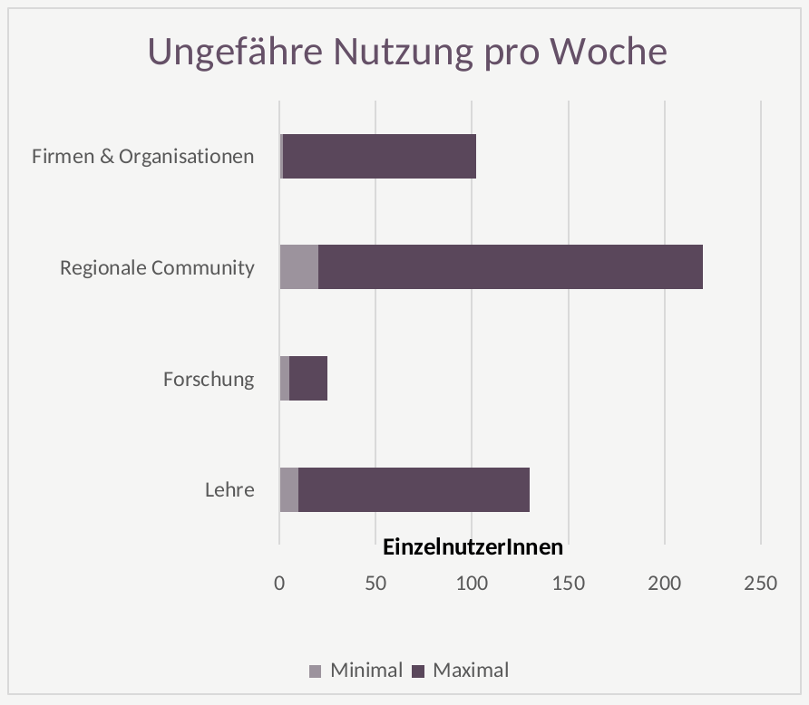

## Auftrag

Das Projekt Fab Lab Siegen setzt seinen Fokus auf digitale Fabrikation, Fabrikations- und Produktionsformen und Märkte der Zukunft, zivilgesellschaftliches Engagement sowie insbesondere Forschung und Lehre im Umfeld dieser Themen. Zu diesem Zwecke ist das Projekt verantwortlich für den Betrieb eines Fabrikationslabores als Infrastruktur an der Universität Siegen, arbeitet jedoch explizit auch interdisziplinär, interfakultativ und über die Universität hinausgehend mit einer Vielzahl an anderen Akteuren zusammen. Das Fab Lab Siegen gibt sich in Abstimmung mit der Zentralverwaltung der Universität Siegen und unter Beachtung der geltenden Regeln und Gesetze eine eigene Ordnung, deren Notwendigkeit sich aus dem Betrieb einer experimentellen Werkstatt mit Laborcharakter ergibt.

## Organisationsform 

Derzeit ist das Fab Lab Siegen organisatorisch ein "Projekt eines Zentralinstituts", der [iSchool Siegen](https://ischool-siegen.de). Aktuell befindet sich die Organisationsform und die Rolle des Fab Labs als Projekt und/oder Infrastruktur in Diskussion und Weiterentwicklung. 

## Entwicklung vom Projekt zur Infrastruktur

*Schematisches Gantt-Chart zur Entwicklung des Fab Lab Siegen, Stand Juli 2019*

*Ungefähre Entwicklung von Nutzer\*Innen, die unser Lab selbständig nutzen dürfen/können* 

*EinzelnutzerInnen inkl. Gäste in einer durchschnittlichen Woche*