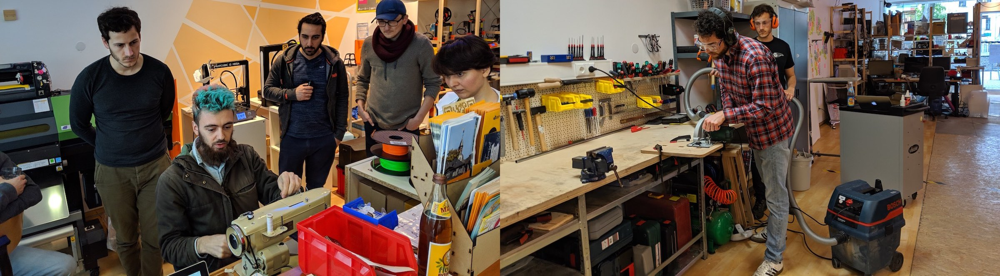

## Lab-Koordinator*Innen (Lab Coordinators)

Die Lab-Koordinator*Innen sind ein [Team von dem Fab Lab Siegen zugeordneten oder dorthin abgeordneten MitarbeiterInnen](/kontakt/kontakt/#ansprechpersonen), die für die operativen Aktivitäten Labors verantwortlich sind. Ihnen obliegen Tätigkeiten wie die Betreuung offener Zeiten, Sicherheit im Labor, die Organisation von Veranstaltungen, die allgemeine Unterstützung von NutzerInnen, die Unterstützung in der Lehre, Management des Fab Labs, Wartung der Maschinen, Community-Management, Öffentlichkeitsarbeit und alle weiteren Anliegen des Tagesgeschäftes. Die Lab-KoordinatorInnen treffen sich regelmäßig, entwickeln Arbeitsmittel und Prozesse, Ordnen ihre Tätigkeiten weitgehend selbständig in Absprache mit dem Advisory Board. Sie berichten mindestens einmal pro Jahr an das Leitungsgremium. 

## Leitungsgremium (Advisory Board)

Das Advisory Board ist das Beratungs- und Steuerungs-Organ, bestehend aus VertreterInnen der sich aktuell personell am Fab Lab beteiligenden Partner. Es nimmt strategische und andere übergeordnete Aufgaben wahr und ist zuständig für die Einhaltung rechtlicher Aspekte (z.B. Arbeitssicherheit). Das Advisory Board bestimmt aus seiner Mitte eine verantwortliche Leiterin oder einen verantwortlichen Leiter (Supervisor). Der/die LeiterIn muss HochschullehrerIn an der Universität Siegen sein oder anderweitig ermächtigt werden, die rollenbezogenen Entscheidungen zu treffen und Verantwortungen zu tragen. Prof. Dr. Volkmar Pipek ist der aktuelle verantwortliche Leiter. 

## Partner und Beteiligungen 

* Derzeit beteiligen sich die Hochschule zentral sowie die Lehrstühle von [Prof. Pipek](http://www.cscw.uni-siegen.de) (CSCW & Social Media) mit ca. 2 Personalstellen und zwei studentischen Hilfskräften sowie [Prof. Hassenzahl](http://experienceandinteraction.com/) (Experience & Interaction) mit ca. 0.25 Personalstellen am Fab Lab. Beide Lehrstühle beteiligen sich auch an laufenden Kosten
* Erste Investments zur Ausstattung erfolgten 2014/15 durch die Uni zentral und die Fakultät III aus Mitteln zur Qualitätsverbesserung in Studium und Lehre. Seitdem wird die Infrastruktur aus Drittmitteln, Förderprogrammen, Spenden und Lehrstuhlmitteln erweitert. 
* Die Stadt Siegen stellt die Räume am Herrengarten zur Verfügung, die Siegener Gesellschaft zur Förderung der Altstadt die Räume am Campus Siegen Mitte (jeweils in Zusammenarbeit mit der Hochschule).
* Unterstützung von Dritten durch Spenden und Sponsoring hilft, den Betrieb zu sichern
* Material-Spenden und -Pooling ergänzen regelmäßig den Materialbedarf im Labor
    