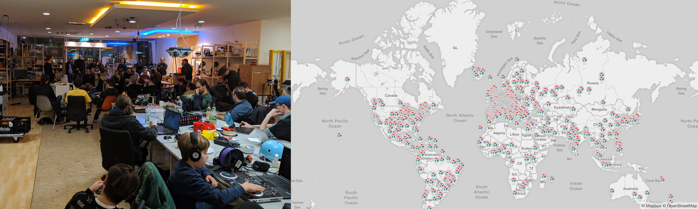
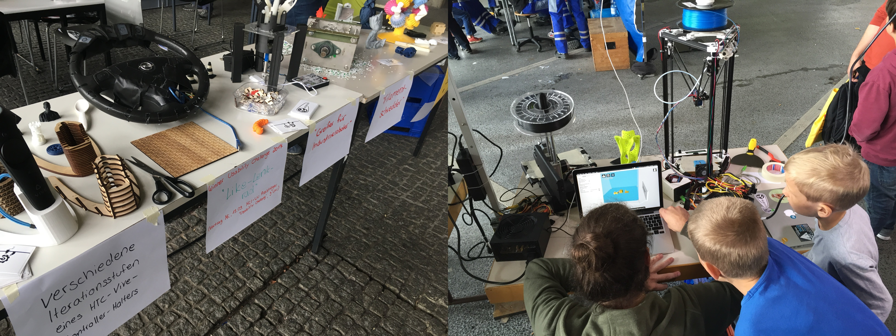

*Fab Labs weltweit & Fab Lab Siegen. Karten-Screenshot von fablabs.io*

Auf bundesweiter Ebene repräsentiert das Fab Lab Siegen die Universität und die Region beispielsweise durch Organisation von temporären Fab Labs und anderen Beiträgen auf Konferenzen/Events, durch bezahlte und ehrenamtliche Workshops/Events/Vorträge bei Dritten, durch Beteiligung an Flüchtlingsprojekten oder in Kooperationen mit (Projekt-)Partnern aktiv. Es besteht Austausch mit der noch kleinen aber wachsenden Community der Fab Labs an Hochschulen in Deutschland. Unter anderem hat [Fab:UNIverse](https://fab101.de/fabuniverse-2018/) - eine der ersten bundesweiten Tagungen für Fab Lab-ManagerInnen an Hochschulen - bei uns in Siegen stattgefunden. 

*Auftritte auf Events und Tagungen*

Auf globaler Ebene ist das Fab Lab Siegen Teil verschiedener Netzwerke und Projektaktivitäten mit unterschiedlichen AkteurInnen wie z.B. dem weltweiten [Verband der Fab Labs](https://www.fablabs.io/), dem V[erbund offener Werkstätten](https://www.offene-werkstaetten.org/) in Deutschland oder dem [Global Innovation Gathering](https://www.globalinnovationgathering.org/). Neben der Außenrepräsentation wird über Wissenstransfer, Zusammenarbeit bei der Mitteleinwerbung und Personalaustausch/-Recruiting sowie personelle Mobilität Mehrwert für die Hochschule und die Region geschaffen. 
